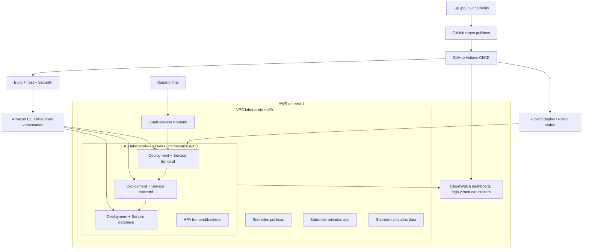

# Diagrama de arquitectura EP03

Copiar este bloque en Mermaid, Draw.io o Markdown y ajustar nombres reales, URLs y recursos.

```mermaid
flowchart TB
    Dev[Equipo / Git commits] --> GH[GitHub repos publicos]
    GH --> GHA[GitHub Actions CI/CD]
    GHA --> Test[Build + Test + Security]
    Test --> ECR[Amazon ECR imagenes versionadas]
    GHA --> Deploy[kubectl deploy / rollout status]

    subgraph AWS[AWS us-east-1]
      subgraph VPC[VPC laboratorio-ep03]
        Public[Subredes publicas]
        PrivateApp[Subredes privadas app]
        PrivateData[Subredes privadas data]
        LB[LoadBalancer frontend]
        subgraph EKS[EKS laboratorio-ep03-eks / namespace ep03]
          FE[Deployment + Service frontend]
          BE[Deployment + Service backend]
          DB[Deployment + Service database]
          HPA[HPA frontend/backend]
        end
      end
      CW[CloudWatch dashboard, logs y metricas custom]
    end

    ECR --> FE
    ECR --> BE
    ECR --> DB
    Deploy --> EKS
    User[Usuario final] --> LB --> FE --> BE --> DB
    EKS --> CW
    GHA --> CW
```
