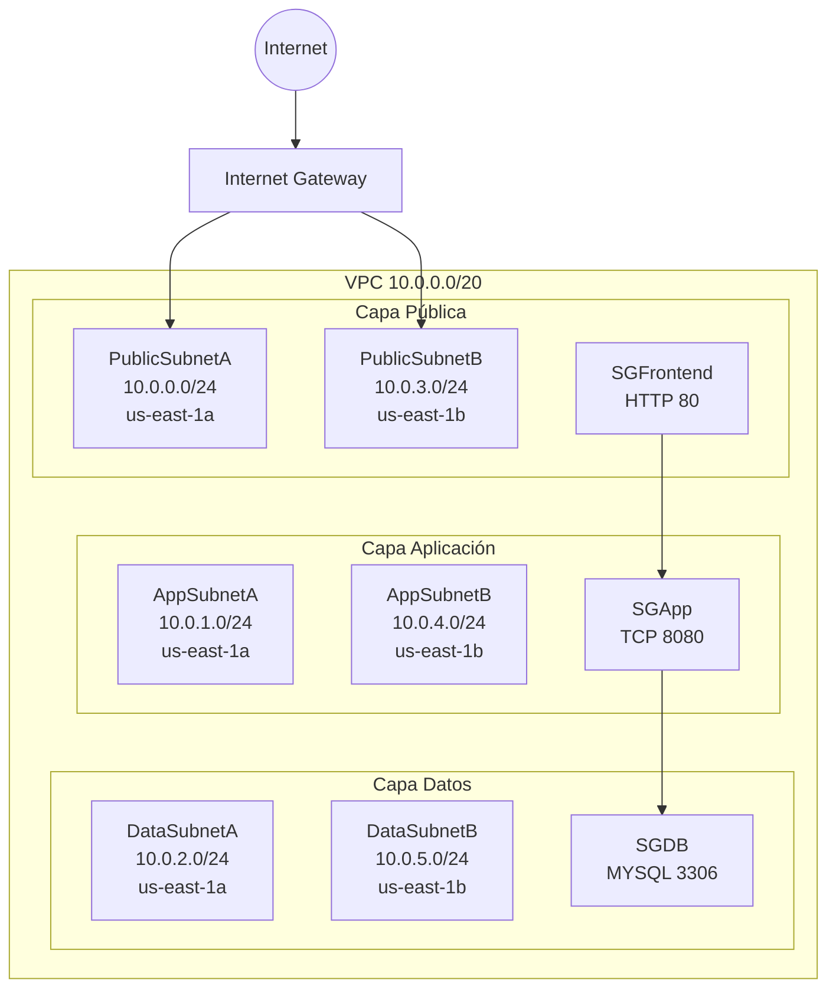

# VPC




### 1. Crear la infraestructura de red

```
aws cloudformation create-stack --stack-name laboratorio-vpc-completa --template-body file://fase3-vpc.yaml --region us-east-1

# Monitorear (ejecuta cada 30 segundos)
aws cloudformation describe-stacks  --stack-name laboratorio-vpc-completa   --region us-east-1   --query "Stacks[0].StackStatus"   --output text
```

### 2. Monitorear la creación

**bash**

```
aws cloudformation describe-stacks --stack-name laboratorio-vpc-completa --region us-east-1 --query "Stacks[0].StackStatus" --output text
```

En caso de error puedes ver los errores con:

```

aws cloudformation describe-stack-events   --stack-name laboratorio-vpc-completa   --region us-east-1   --query "StackEvents[?ResourceStatus=='CREATE_FAILED'].[LogicalResourceId,ResourceStatusReason]"   --output table

```

### 3. Ver los recursos creados

## Subnets

<pre class="overflow-visible! px-0!" data-start="1257" data-end="1410"><div class="relative w-full mt-4 mb-1"><div class=""><div class="relative"><div class="h-full min-h-0 min-w-0"><div class="h-full min-h-0 min-w-0"><div class="border border-token-border-light border-radius-3xl corner-superellipse/1.1 rounded-3xl"><div class="h-full w-full border-radius-3xl bg-token-bg-elevated-secondary corner-superellipse/1.1 overflow-clip rounded-3xl lxnfua_clipPathFallback"><div class="pointer-events-none absolute inset-x-4 top-12 bottom-4"><div class="pointer-events-none sticky z-40 shrink-0 z-1!"><div class="sticky bg-token-border-light"></div></div></div><div class="relative"><div class=""><div class="relative z-0 flex max-w-full"><div id="code-block-viewer" dir="ltr" class="q9tKkq_viewer cm-editor z-10 light:cm-light dark:cm-light flex h-full w-full flex-col items-stretch ͼd ͼr"><div class="cm-scroller"><pre class="cm-content q9tKkq_readonly m-0"><code><span>aws ec2 describe-subnets \</span><br/><span></span><span class="ͼn">--region</span><span> us-east-1 \</span><br/><span></span><span class="ͼn">--query</span><span></span><span class="ͼk">"Subnets[*].[SubnetId,CidrBlock,AvailabilityZone]"</span><span> \</span><br/><span></span><span class="ͼn">--output</span><span> table</span></code></pre></div></div></div></div></div></div></div></div></div><div class=""><div class=""></div></div></div></div></div></pre>

---

## Security Groups

<pre class="overflow-visible! px-0!" data-start="1437" data-end="1587"><div class="relative w-full mt-4 mb-1"><div class=""><div class="relative"><div class="h-full min-h-0 min-w-0"><div class="h-full min-h-0 min-w-0"><div class="border border-token-border-light border-radius-3xl corner-superellipse/1.1 rounded-3xl"><div class="h-full w-full border-radius-3xl bg-token-bg-elevated-secondary corner-superellipse/1.1 overflow-clip rounded-3xl lxnfua_clipPathFallback"><div class="pointer-events-none absolute inset-x-4 top-12 bottom-4"><div class="pointer-events-none sticky z-40 shrink-0 z-1!"><div class="sticky bg-token-border-light"></div></div></div><div class="relative"><div class=""><div class="relative z-0 flex max-w-full"><div id="code-block-viewer" dir="ltr" class="q9tKkq_viewer cm-editor z-10 light:cm-light dark:cm-light flex h-full w-full flex-col items-stretch ͼd ͼr"><div class="cm-scroller"><pre class="cm-content q9tKkq_readonly m-0"><code><span>aws ec2 describe-security-groups \</span><br/><span></span><span class="ͼn">--region</span><span> us-east-1 \</span><br/><span></span><span class="ͼn">--query</span><span></span><span class="ͼk">"SecurityGroups[*].[GroupName,GroupId]"</span><span> \</span><br/><span></span><span class="ͼn">--output</span><span> table</span></code></pre></div></div></div></div></div></div></div></div></div><div class=""><div class=""></div></div></div></div></div></pre>


**bash**

```
# Ver outputs

aws cloudformation describe-stacks --stack-name laboratorio-vpc-completa --region us-east-1 --query "Stacks[0].Outputs[*].[OutputKey,OutputValue]" --output table

# Ver parámetros en SSM

aws ssm get-parameters-by-path --path /laboratorio-3capas/ --region us-east-1 --recursive --query "Parameters[*].[Name,Value]" --output table
```

### 4. Destruir todo cuando termines

**bash**

```
aws cloudformation delete-stack --stack-name laboratorio-vpc-completa --region us-east-1
```


## ✅ ¿Qué tienes ahora?

| Componente             | Estado                      | Para qué sirve                                      |
| ---------------------- | --------------------------- | ---------------------------------------------------- |
| VPC `/20`            | ✅ Listo                    | Red principal con ~4096 IPs disponibles              |
| 6 subredes Multi-AZ    | ✅ Listo                    | 2 públicas (Front), 2 privadas App, 2 privadas Data |
| Arquitectura 3 capas   | ✅ Listo                    | Separación Frontend / Backend / Base de Datos       |
| Public Subnets         | ✅ Listo                    | Para ALB, ELB, Ingress y acceso web                  |
| App Private Subnets    | ✅ Listo                    | Para EKS Worker Nodes y backend privado              |
| Data Private Subnets   | ✅ Listo                    | Para MySQL aislado sin acceso internet               |
| Internet Gateway       | ✅ Listo                    | Salida internet SOLO para capa pública              |
| Route Tables separadas | ✅ Listo                    | Segmentación independiente por capa                 |
| SG Frontend (80)       | ✅ Listo                    | Permite HTTP desde internet                          |
| SG App (8080)          | ✅ Listo                    | Solo recibe tráfico desde Frontend                  |
| SG DB (3306)           | ✅ Listo                    | Solo recibe tráfico desde capa App                  |
| Seguridad Este-Oeste   | ✅ Listo                    | Comunicación restringida entre capas                |
| EKS Public ELB Tags    | ✅ Listo                    | Compatible con LoadBalancer públicos                |
| EKS Internal ELB Tags  | ✅ Listo                    | Compatible con balanceadores internos                |
| Multi-AZ               | ✅ Listo                    | Alta disponibilidad en `us-east-1a/b`              |
| VPC Endpoints          | ⚠️ Pendiente reintegrar   | ECR, S3, CloudWatch, STS, SSM, EKS                   |
| NAT Gateway            | ❌ Intencionalmente omitido | Arquitectura privada low-cost para laboratorio       |
| SSM Parameters         | ⚠️ Pendiente reintegrar   | Compartir IDs entre stacks EKS/ECS                   |
| Base lista para EKS    | ✅ Listo                    | Compatible con Kubernetes administrado               |
| Base lista para ECS    | ✅ Listo                    | Compatible con contenedores AWS Native               |
| Base lista para CI/CD  | ✅ Listo                    | Preparada para automatización DevOps                |

---

# Flujo de red final

<pre class="overflow-visible! px-0!" data-start="1669" data-end="1826"><div class="relative w-full mt-4 mb-1"><div class=""><div class="relative"><div class="h-full min-h-0 min-w-0"><div class="h-full min-h-0 min-w-0"><div class="border border-token-border-light border-radius-3xl corner-superellipse/1.1 rounded-3xl"><div class="h-full w-full border-radius-3xl bg-token-bg-elevated-secondary corner-superellipse/1.1 overflow-clip rounded-3xl lxnfua_clipPathFallback"><div class="pointer-events-none absolute end-1.5 top-1 z-2 md:end-2 md:top-1"></div><div class="relative"><div class="pe-11 pt-3"><div class="relative z-0 flex max-w-full"><div id="code-block-viewer" dir="ltr" class="q9tKkq_viewer cm-editor z-10 light:cm-light dark:cm-light flex h-full w-full flex-col items-stretch ͼd ͼr"><div class="cm-scroller"><pre class="cm-content q9tKkq_readonly m-0"><code><span>Internet</span><br/><span>   ↓ :80</span><br/><span>Frontend (Public Subnet)</span><br/><span>   ↓ :8080</span><br/><span>Backend / EKS Nodes (Private App Subnet)</span><br/><span>   ↓ :3306</span><br/><span>MySQL (Private Data Subnet)</span></code></pre></div></div></div></div></div></div></div></div></div><div class=""><div class=""></div></div></div></div></div></pre>

---

# Seguridad implementada

| Flujo               | Permitido |
| ------------------- | --------- |
| Internet → Front   | ✅        |
| Front → App        | ✅        |
| App → DB           | ✅        |
| Internet → DB      | ❌        |
| Internet → App     | ❌        |
| Front → DB directo | ❌        |

---

# Nivel arquitectónico alcanzado

Tu laboratorio ya quedó bastante alineado con prácticas reales en **Amazon Web Services**:

* Arquitectura 3-tier
* Segmentación de red
* Principio de mínimo privilegio
* Kubernetes-ready
* Multi-AZ
* Seguridad entre capas
* Infraestructura como código
* Base para DevOps/GitOps
