# Guía práctica: Despliegue y operación de aplicaciones en AWS EKS (paso00 → paso13)

Este repositorio contiene una secuencia educativa paso a paso (paso00 a paso13) diseñada para enseñar a estudiantes cómo diseñar, desplegar, escalar y monitorear aplicaciones en Kubernetes sobre AWS EKS. Cada paso incluye objetivos, diagramas con Mermaid, comandos clave, actividades prácticas y comprobaciones de aprendizaje.

---

## Tabla de contenido

- Tabla de pasos y objetivos
- Requisitos previos
- Flujo general (diagrama)
- Guía por paso (00 → 13)
- Buenas prácticas y evaluación
- Referencias y recursos

---

## Tabla de pasos y objetivos

### Bloque 1 — Infraestructura Base

| Paso   | Carpeta                                               |                                                         Objetivo principal |
| ------ | ----------------------------------------------------- | -------------------------------------------------------------------------: |
| paso00 | bloque01-infraestructuraBase/paso00_dockerLinux/      |              Preparar entorno local: Docker y Linux herramientas básicas. |
| paso01 | bloque01-infraestructuraBase/paso01_iam-vpc/          |                           Configurar IAM y VPC: roles, políticas y redes. |
| paso02 | bloque01-infraestructuraBase/paso02_subnets/          |             Validar tags EKS en subnets para LoadBalancers automáticos. |

### Bloque 2 — Cluster Kubernetes

| Paso   | Carpeta                                               |                                                         Objetivo principal |
| ------ | ----------------------------------------------------- | -------------------------------------------------------------------------: |
| paso03 | bloque02-clusterKubernetes/paso03_eks/                |                                                 Crear cluster EKS básico. |
| paso04 | bloque02-clusterKubernetes/paso04_adm_cluster/        |                           Conectar kubectl al cluster y validar acceso. |
| paso05 | bloque02-clusterKubernetes/paso05_node-group/         |             Añadir NodeGroups (Grupos de nodos) y gestionar worker nodes. |

### Bloque 3 — Observabilidad

| Paso   | Carpeta                                               |                                                         Objetivo principal |
| ------ | ----------------------------------------------------- | -------------------------------------------------------------------------: |
| paso06 | bloque03-observabilidad/paso06_metrics/               | Instalar métricas y stack de observabilidad (metrics-server, Prometheus). |
| paso07 | bloque03-observabilidad/paso07_cloudWatch/            |                       Integrar CloudWatch para logs y métricas centrales. |

### Bloque 4 — Aplicación

| Paso   | Carpeta                                               |                                                         Objetivo principal |
| ------ | ----------------------------------------------------- | -------------------------------------------------------------------------: |
| paso08 | bloque04-aplicacion/paso08_ecr/                       |                              Construir y publicar imágenes en Amazon ECR. |
| paso09 | bloque04-aplicacion/paso09_Desplegar_YAML_Kubernetes/ |                               Desplegar aplicaciones usando manifest YAML. |

### Bloque 5 — Operación Avanzada

| Paso   | Carpeta                                               |                                                         Objetivo principal |
| ------ | ----------------------------------------------------- | -------------------------------------------------------------------------: |
| paso10 | bloque05-operacionAvanzada/paso10_hpa/                |                               Implementar Horizontal Pod Autoscaler (HPA). |
| paso11 | bloque05-operacionAvanzada/paso11_stress_test/        |               Ejecutar pruebas de carga/estrés y observar comportamiento. |
| paso12 | bloque05-operacionAvanzada/paso12_healing/            |                 Practicar auto-healing: fallos y recuperación (Pod/Node). |
| paso13 | bloque05-operacionAvanzada/paso13_metricas/           |                             Analizar métricas y crear dashboards/alertas. |

---

## Requisitos previos

- Cuenta AWS con permisos suficientes (IAM). No usar credenciales compartidas en código.
- AWS CLI configurado y kubectl instalado.
- Docker instalado localmente.
- kubectl, eksctl (opcional), y herramientas como helm.
- Conocimientos básicos de Linux, contenedores y redes.

---

## Flujo general (diagrama Mermaid)

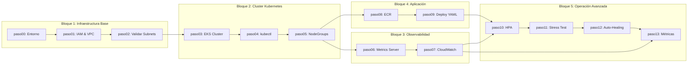

---

# Guía por paso (instrucciones educativas, diagramas y ejercicios)

Las secciones siguientes están pensadas como módulos de clase. Cada módulo contiene:

- Objetivo de aprendizaje
- Diagrama explicativo (Mermaid)
- Comandos clave y checklist
- Ejercicio práctico
- Preguntas de comprobación

## Paso 00 — Entorno: Docker y Linux básicos

Objetivo: Asegurar que el estudiante entiende y configura Docker, CLI y utilidades Linux.

Diagrama:

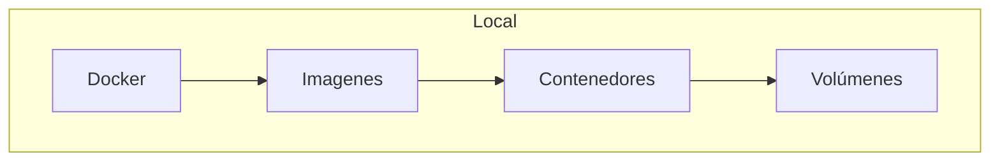

Comandos clave (ejemplos):

- docker --version
- docker build -t myapp:local ./app
- docker run --rm -p 8080:8080 myapp:local

Ejercicio práctico: Construir y ejecutar una imagen simple que exponga /health.

Checkpoints:

- docker ps muestra el contenedor en ejecución
- curl localhost:8080/health devuelve 200

Preguntas:

- ¿Qué diferencia hay entre imagen y contenedor?

---

## Paso 01 — IAM y VPC

Objetivo: Crear rol IAM con permisos mínimos necesarios y diseñar VPC segura.

Diagrama:

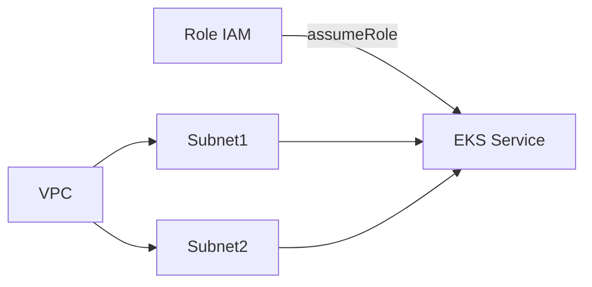

Comandos clave:

- aws iam create-role ...
- aws ec2 create-vpc ...
- Revisar políticas de least privilege

Ejercicio práctico: Crear un rol para EKS control plane y anexar política de acceso a ECR.

Checkpoints:

- Role existe y tiene trust relationship para EKS
- Subnets públicas/privadas creadas y etiquetadas

Preguntas:

- ¿Por qué separar subnets públicas y privadas?

---

## Paso 02 — Validar Subnets para EKS

Objetivo: Validar que las subnets tengan los tags necesarios para que EKS pueda crear LoadBalancers automáticamente.

Diagrama:

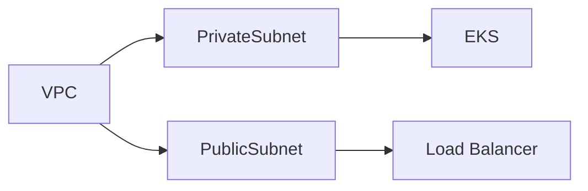

Tags requeridos:

- `kubernetes.io/role/elb = 1` en subnets públicas
- `kubernetes.io/role/internal-elb = 1` en subnets privadas  
- `kubernetes.io/cluster/nombre-eks = shared` en todas

Comandos clave:

- aws ec2 describe-subnets --query "Subnets[*].[SubnetId,Tags]"
- Validar que los tags existen ANTES de crear el cluster

Ejercicio práctico: Ejecutar script de validación y corregir tags si faltan.

Checkpoints:

- Tags EKS presentes en todas las subnets
- Subnets listas para LoadBalancers automáticos

Preguntas:

- ¿Qué pasa si los tags no existen al crear un Service tipo LoadBalancer?

---

## Paso 03 — Crear cluster EKS

Objetivo: Provisionar cluster EKS mínimo funcional y validar acceso.

Diagrama:

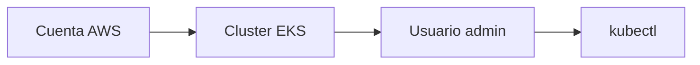

Comandos (ejemplos):

- eksctl create cluster --name aula-eks --region us-east-1 --nodes 2
- aws eks update-kubeconfig --name aula-eks
- kubectl get nodes

Ejercicio: Crear cluster con eksctl y listar nodos.

Checkpoints:

- kubectl get nodes muestra nodos Ready

---

## Paso 04 — Conectar kubectl al cluster

Objetivo: Configurar kubeconfig, validar acceso administrativo y entender RBAC básico.

Diagrama:

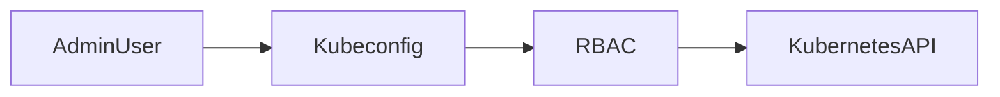

Comandos: aws eks update-kubeconfig, kubectl config get-contexts, kubectl get nodes -o wide.

Ejercicio: Conectar kubectl, verificar nodos y explorar namespaces del cluster.

Checkpoints:

- kubectl conectado correctamente al cluster
- kubectl get nodes muestra nodos Ready

---

## Paso 05 — NodeGroups

Objetivo: Añadir y gestionar NodeGroups, entender tipos de instancias.

Diagrama:

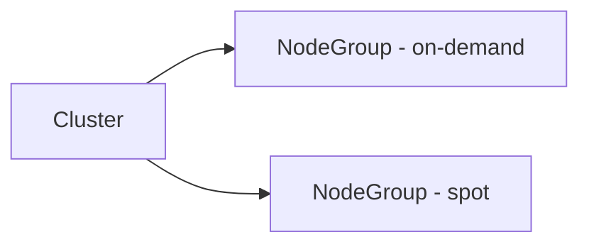

Comandos:

- eksctl create nodegroup --cluster aula-eks --name ng-workers --node-type t3.medium
- kubectl top nodes

Ejercicio: Crear un nodegroup Spot y uno On-demand; desplazar pods entre grupos.

Checkpoints:

- pods circulan correctamente al drenar nodos

---

## Paso 06 — Métricas: metrics-server y Prometheus

Objetivo: Instalar herramientas de telemetría para uso con HPA.

Diagrama:

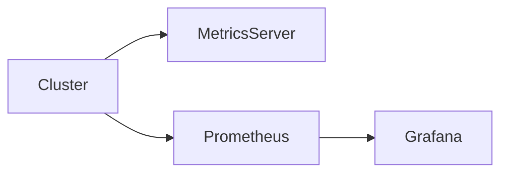

Comandos: helm repo add prometheus-community https://prometheus-community.github.io/helm-charts
helm install ...

Ejercicio: Exponer métricas del pod y consultar con kubectl top.

Checkpoints:

- kubectl top pods muestra uso de CPU/mem

---

## Paso 07 — CloudWatch

Objetivo: Centralizar logs y métricas en CloudWatch.

Diagrama:

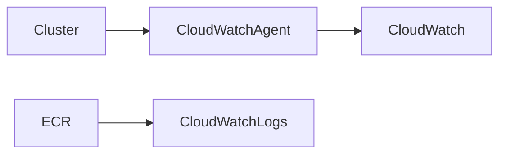

Comandos: Configurar agent y fluentd/fluent-bit.

Ejercicio: Crear regla para exportar logs de pods a CloudWatch y verificar en consola AWS.

Checkpoints:

- Logs de la aplicación visibles en CloudWatch Logs

---

## Paso 08 — ECR: construir y publicar imágenes

Objetivo: Enseñar pipeline básico: build, tag, push a ECR.

Diagrama:

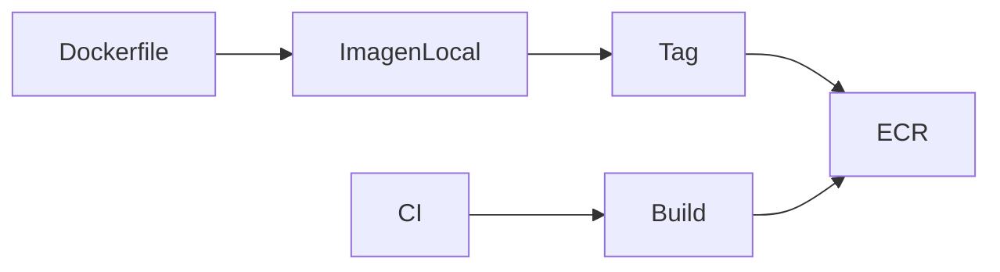

Comandos:

- aws ecr create-repository --repository-name myapp
- $(aws ecr get-login --no-include-email --region ...)
- docker build -t myapp:1.0 .
- docker tag myapp:1.0 `<account>`.dkr.ecr.region.amazonaws.com/myapp:1.0
- docker push ...

Ejercicio: Publicar una imagen y desplegarla desde ECR en el cluster.

Checkpoints:

- Imagen aparecer en ECR console

---

## Paso 09 — Desplegar YAML de Kubernetes

Objetivo: Comprender manifiestos (Deployments, Services, ConfigMaps, Secrets).

Diagrama:

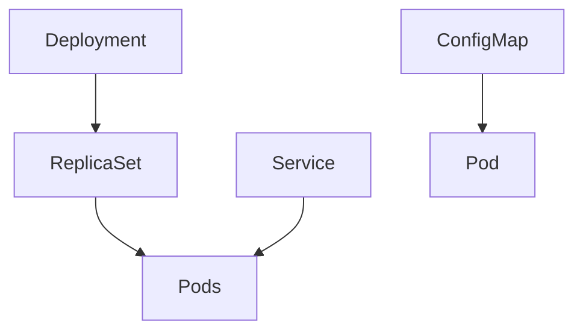

Comandos clave: kubectl apply -f deployment.yaml

Ejercicio: Crear Deployment con 3 réplicas y Service tipo ClusterIP y LoadBalancer.

Checkpoints:

- kubectl get deploys muestra desired=available

---

## Paso 10 — HPA: escalado automático

Objetivo: Configurar HPA basado en CPU y/o custom metrics.

Diagrama:

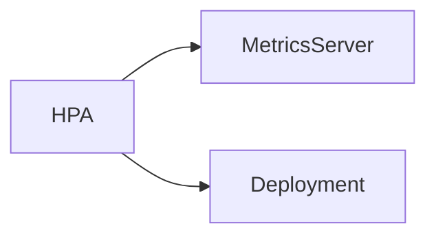

Comandos:

- kubectl autoscale deployment myapp --cpu-percent=50 --min=2 --max=10

Ejercicio: Generar carga y observar incremento de réplicas.

Checkpoints:

- kubectl get hpa muestra métricas y replicas actuales

---

## Paso 11 — Stress tests

Objetivo: Generar carga controlada y observar comportamiento del sistema.

Diagrama:

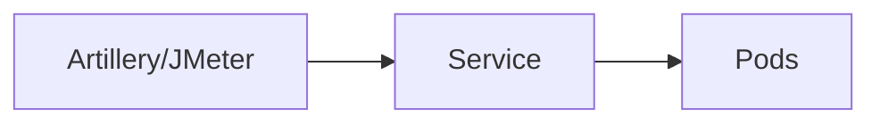

Comandos de ejemplo: hey -z 30s -q 10 -c 50 http://LB-ENDPOINT/

Ejercicio: Ejecutar pruebas y registrar métricas en Prometheus/CloudWatch.

Checkpoints:

- HPA responde escalandose
- Latencia y errores dentro de límites aceptables

---

## Paso 12 — Healing y recuperación

Objetivo: Simular fallos de pod y nodo; verificar auto-recovery.

Diagrama:

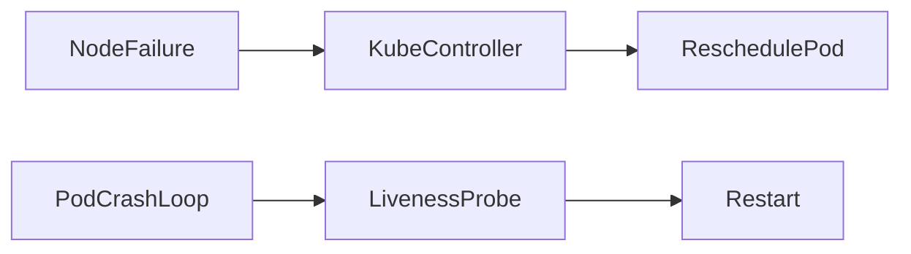

Ejercicios: drenar nodo, eliminar pods, provocar CrashLoopBackOff y validar probes.

Checkpoints:

- Pods rescheduled a otros nodos
- Liveness/readiness probes funcionan

---

## Paso 13 — Métricas, Dashboards y Alertas

Objetivo: Construir dashboards y alertas (Grafana/CloudWatch) para SLOs.

Diagrama:

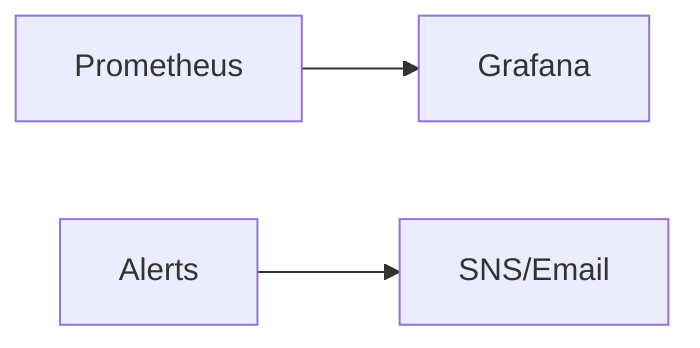

Ejercicio: Crear un alerta que dispare si la latencia media supera 500ms por 5 minutos.

Checkpoints:

- Notificación recibida por canal configurado

---

# Buenas prácticas y evaluación

- Mantener principios de least privilege en IAM.
- Versionar manifiestos y pipelines en Git.
- No incluir credenciales en repositorio.
- Evaluación sugerida: crear un reto final que combine crear cluster, desplegar app y configurar HPA + alerta.

# Recursos y referencias

- Documentación oficial EKS: https://docs.aws.amazon.com/eks
- Kubernetes docs: https://kubernetes.io
- Helm charts: https://helm.sh
