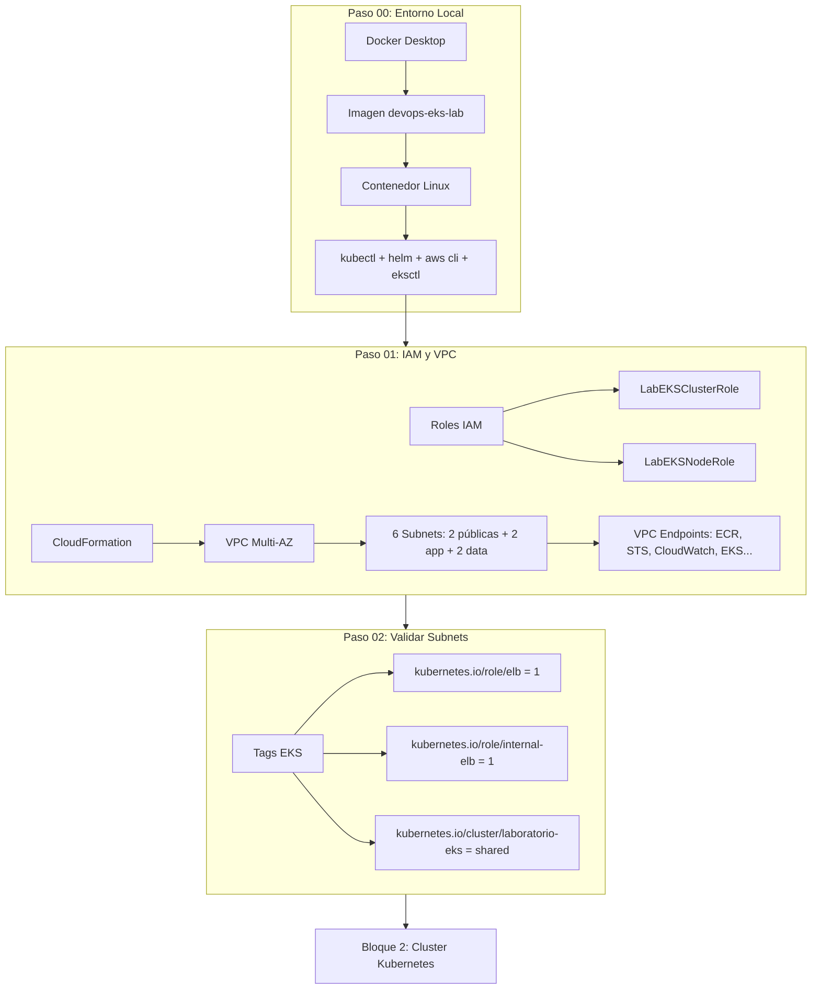

# Bloque 1 — Infraestructura Base

> **Objetivo:** Preparar todo lo necesario para que el cluster EKS tenga una base sólida: entorno local, credenciales AWS, red privada y validación de subnets.

---

## ¿Qué se construye aquí?

Antes de crear un solo recurso Kubernetes, necesitamos tres cosas firmes bajo los pies:

1. **Un entorno de trabajo** con Docker, AWS CLI, kubectl y herramientas DevOps.
2. **Una cuenta AWS configurada** con roles IAM que autoricen a EKS a operar.
3. **Una VPC correctamente etiquetada** para que Kubernetes pueda crear Load Balancers automáticamente.



---

## Pasos del bloque

| # | Carpeta | ¿Qué se hace? |
|---|---------|---------------|
| **00** | `paso00_dockerLinux/` | Construir imagen Docker con todas las herramientas (kubectl, helm, eksctl, terraform, k9s). Conectarse a AWS Academy. |
| **01** | `paso01_iam-vpc/` | Validar roles IAM para EKS. Crear VPC completa con CloudFormation: subnets, route tables, VPC Endpoints, tags EKS. |
| **02** | `paso02_subnets/` | Validar que las subnets tengan los tags correctos para que Kubernetes pueda crear LoadBalancers automáticos. |

---

## ¿Por qué en este orden?

| Si hicieras esto... | Pasaría esto... |
|---------------------|-----------------|
| Crear EKS sin validar IAM | El cluster no se crea o falla al iniciar |
| Crear EKS sin tags en subnets | Los Services tipo LoadBalancer quedan en `<pending>` para siempre |
| Crear NodeGroup sin VPC Endpoints | Los nodos privados no pueden descargar imágenes de ECR |

---

## Al terminar este bloque tendrás

- [x] Contenedor Linux con AWS CLI, kubectl, helm, eksctl, terraform, k9s
- [x] Credenciales AWS configuradas y validadas
- [x] Roles IAM `LabEKSClusterRole` y `LabEKSNodeRole` operativos
- [x] VPC Multi-AZ con 6 subnets y VPC Endpoints privados
- [x] Tags EKS verificados en todas las subnets

---

## Siguiente bloque

```text
Bloque 2 — Cluster Kubernetes: crear el cluster EKS, conectar kubectl y añadir worker nodes.
```
