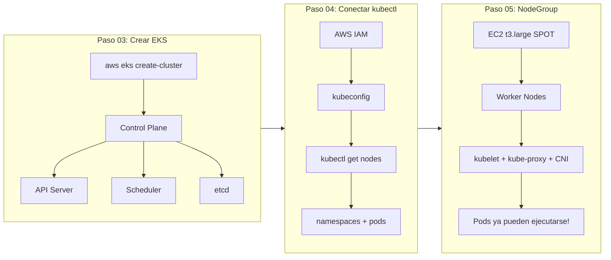

# Bloque 2 — Cluster Kubernetes

> **Objetivo:** Crear el cluster Amazon EKS, conectar la herramienta kubectl y añadir los worker nodes que ejecutarán las aplicaciones.

---

## ¿Qué se construye aquí?

Este es el corazón de la guía. Pasamos de "tener infraestructura AWS" a "tener un cluster Kubernetes funcionando". En tres pasos:

1. **Crear el Control Plane** — Amazon EKS provisiona el API Server, scheduler, controller manager y etcd.
2. **Conectar kubectl** — La terminal se vuelve el panel de control del cluster.
3. **Añadir Node Groups** — Las instancias EC2 que realmente ejecutan los Pods.



---

## Pasos del bloque

| # | Carpeta | ¿Qué se hace? |
|---|---------|---------------|
| **03** | `paso03_eks/` | Crear el cluster EKS con `aws eks create-cluster`. Configurar Security Group, subnets, endpoint access. Esperar estado `ACTIVE` (~15 min). |
| **04** | `paso04_adm_cluster/` | Ejecutar `aws eks update-kubeconfig`. Validar conexión con `kubectl get nodes`. Explorar namespaces y pods del sistema. |
| **05** | `paso05_node-group/` | Crear Managed Node Group con instancias SPOT `t3.large` en subnets privadas. Validar que los nodos aparezcan `Ready` y `kube-system` funcione. |

---

## Componentes que aparecen por primera vez

| Componente | ¿Qué es? | ¿Dónde se ve? |
|------------|----------|---------------|
| **Control Plane** | El "cerebro" de Kubernetes. AWS lo administra. | No se ve directamente, pero `kubectl` le habla. |
| **kubeconfig** | Archivo que guarda la conexión y credenciales al cluster. | `~/.kube/config` |
| **Worker Node** | Instancia EC2 que ejecuta los Pods. Contiene kubelet, container runtime y kube-proxy. | `kubectl get nodes` |
| **NodeGroup** | Conjunto administrado de worker nodes. AWS maneja auto-scaling y actualizaciones. | `aws eks describe-nodegroup` |
| **kube-system** | Namespace donde viven los Pods del sistema (CoreDNS, aws-node, kube-proxy, metrics-server). | `kubectl get pods -n kube-system` |

---

## Al terminar este bloque tendrás

- [x] Cluster EKS en estado `ACTIVE`
- [x] kubectl conectado y funcionando
- [x] Worker nodes EC2 `Ready`
- [x] Pods del sistema (`kube-system`) saludables
- [x] Kubernetes listo para recibir aplicaciones

---

## Siguientes bloques

```text
Bloque 3 — Observabilidad: instalar métricas y conectar CloudWatch.

Bloque 4 — Aplicación: publicar imágenes en ECR y desplegar en Kubernetes.
```

> Estos dos bloques pueden cursarse en paralelo.
