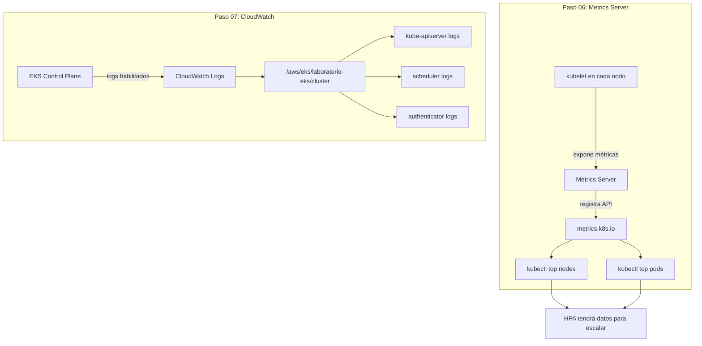

# Bloque 3 — Observabilidad

> **Objetivo:** Dotar al cluster de herramientas para ver qué está pasando: métricas de CPU/memoria y logs centralizados en CloudWatch.

---

## ¿Qué se construye aquí?

Un cluster sin monitoreo es como volar de noche sin instrumentos. Este bloque instala dos capas:

1. **Metrics Server** — Recolecta CPU y memoria de nodos y Pods. Sin esto, `kubectl top` no funciona y HPA no puede escalar.
2. **CloudWatch** — Centraliza los logs del Control Plane de EKS en AWS, permitiendo auditoría y diagnóstico.



---

## Pasos del bloque

| # | Carpeta | ¿Qué se hace? |
|---|---------|---------------|
| **06** | `paso06_metrics/` | Validar que Metrics Server esté instalado como EKS Addon. Verificar `kubectl top nodes` y `kubectl top pods`. Confirmar que `metrics.k8s.io` está `True`. |
| **07** | `paso07_cloudWatch/` | Verificar que los logs del Control Plane estén habilitados. Explorar `/aws/eks/laboratorio-eks/cluster` en CloudWatch. Validar que el VPC Endpoint `logs` esté `available`. |

---

## Conceptos clave

| Concepto | Significado |
|----------|-------------|
| **Metrics Server** | Agregador liviano de métricas. No almacena histórico. El HPA lo consulta cada 15 segundos para decidir si escala. |
| **metrics.k8s.io** | API de Kubernetes que Metrics Server registra. Sin ella, `kubectl top` devuelve error. |
| **CloudWatch Logs** | Servicio AWS que recibe y almacena logs. EKS envía automáticamente los logs del Control Plane. |
| **VPC Endpoint logs** | Conexión privada desde la VPC a CloudWatch. Permite que nodos sin internet envíen logs. |

---

## ¿Por qué aquí y no antes?

| Razón | Explicación |
|-------|-------------|
| Metrics Server necesita nodos | Sin worker nodes, no hay kubelet de dónde recolectar métricas. |
| CloudWatch necesita el cluster creado | Los logs se generan cuando el Control Plane está operativo. |
| Se cursa en paralelo con Bloque 4 | Mientras instalas métricas, puedes ir publicando imágenes en ECR. |

---

## Al terminar este bloque tendrás

- [x] `kubectl top nodes` muestra CPU y memoria de cada nodo
- [x] `kubectl top pods -A` muestra métricas de todos los Pods
- [x] API `metrics.k8s.io` registrada y funcionando
- [x] Logs del Control Plane visibles en CloudWatch
- [x] HPA tendrá los datos que necesita para funcionar (Bloque 5)

---

## Siguiente bloque

```text
Bloque 4 — Aplicación: construir imágenes Docker y publicarlas en ECR.
```
