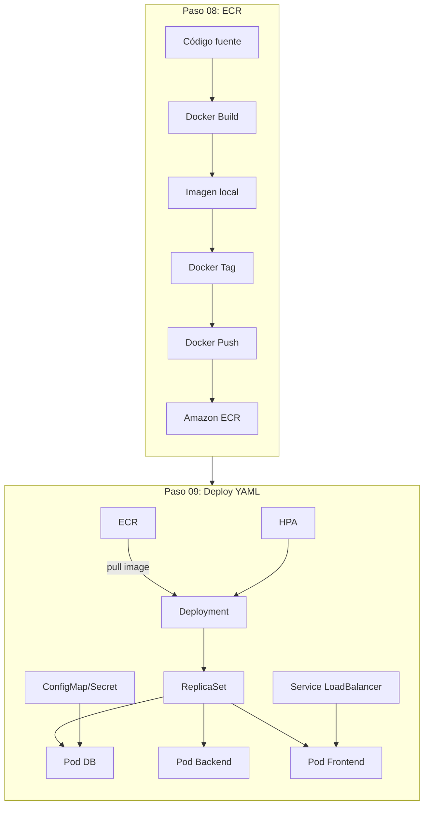

# Bloque 4 — Aplicación

> **Objetivo:** Construir las imágenes Docker de una aplicación multicapa, publicarlas en Amazon ECR y desplegarlas en el cluster EKS usando manifiestos YAML.

---

## ¿Qué se construye aquí?

Hasta ahora tenemos un cluster vacío. Este bloque le da vida con una aplicación real de 3 capas:

1. **Construir imágenes** — Cada capa (frontend, backend, base de datos) se empaqueta en un contenedor Docker.
2. **Publicar en ECR** — Las imágenes se suben al registro privado de AWS.
3. **Desplegar con YAML** — Kubernetes crea los Pods desde esas imágenes usando Deployments, Services, Secrets y HPA.



---

## Pasos del bloque

| # | Carpeta | ¿Qué se hace? |
|---|---------|---------------|
| **08** | `paso08_ecr/` | **Parte 1:** Login en ECR, crear 3 repositorios (`tienda-db`, `tienda-backend`, `tienda-frontend`). **Parte 2:** Docker build → tag → push para cada capa. Validar que las imágenes aparezcan en la consola AWS. |
| **09** | `paso09_Desplegar_YAML_Kubernetes/` | Actualizar los archivos YAML con la URI de ECR. Aplicar en orden: DB → Backend → Frontend. Validar Pods `Running`, Services activos, HPA configurados y LoadBalancer accesible. |

---

## La aplicación que se despliega

```
┌─────────────────────────────────────────┐
│  Usuario → LoadBalancer (AWS ELB)        │
│              ↓                           │
│  ┌─────────────────────────┐            │
│  │  Frontend (Nginx + JS)  │  ← 2+ Pods │
│  └───────────┬─────────────┘            │
│              ↓                           │
│  ┌─────────────────────────┐            │
│  │  Backend (Node.js API)  │  ← 2+ Pods │
│  └───────────┬─────────────┘            │
│              ↓                           │
│  ┌─────────────────────────┐            │
│  │  MySQL (Base de datos)  │  ← 1 Pod   │
│  └─────────────────────────┘            │
│                                          │
│  Namespace: tienda                       │
└─────────────────────────────────────────┘
```

---

## ¿Por qué este orden?

| Orden | Componente | Razón |
|-------|-----------|-------|
| 1º | Database | Backend necesita MySQL corriendo para conectarse. |
| 2º | Backend | Frontend consume la API del backend. |
| 3º | Frontend | Es la cara visible. Sin backend y DB, no funciona. |

---

## Recursos Kubernetes que aparecen

| Recurso | ¿Qué es? | Archivo |
|---------|----------|---------|
| **Namespace** | Aísla recursos por proyecto. Todo vive en `tienda`. | `namespace.yaml` |
| **Deployment** | Define cuántas réplicas, qué imagen, recursos y probes. | `*-deployment.yaml` |
| **Service** | Expone los Pods dentro del cluster (ClusterIP) o hacia afuera (LoadBalancer). | `*-service.yaml` |
| **Secret** | Guarda datos sensibles (contraseña MySQL) en base64. | `mysql-secret.yaml` |
| **HPA** | Define escalado automático por CPU. | `*-hpa.yaml` |

---

## Al terminar este bloque tendrás

- [x] 3 repositorios en Amazon ECR con imágenes versionadas
- [x] Namespace `tienda` creado
- [x] MySQL corriendo en 1 Pod
- [x] Backend corriendo en 2+ Pods con HPA
- [x] Frontend accesible vía LoadBalancer con HPA
- [x] `kubectl get pods -n tienda` muestra todos los Pods `Running`

---

## Siguiente bloque

```text
Bloque 5 — Operación Avanzada: HPA, stress test, auto-healing y dashboards de métricas.
```
