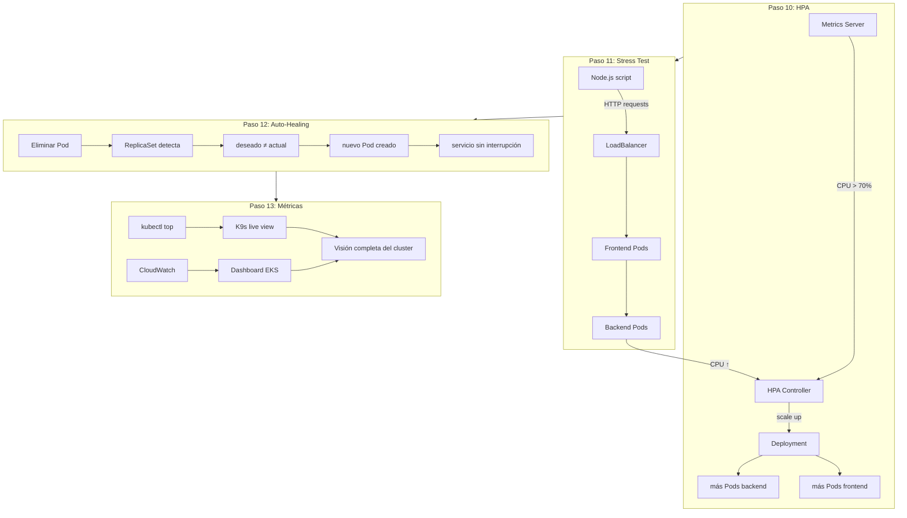

# Bloque 5 — Operación Avanzada

> **Objetivo:** Demostrar las capacidades más potentes de Kubernetes: escalado automático bajo carga, recuperación ante fallos y monitoreo integral.

---

## ¿Qué se construye aquí?

La aplicación ya está corriendo. Ahora la ponemos a prueba en escenarios reales de producción:

1. **HPA en acción** — El Horizontal Pod Autoscaler aumenta y reduce Pods según la CPU.
2. **Stress Test** — Generamos tráfico real para forzar el escalado y verlo ocurrir en vivo.
3. **Auto-Healing** — Matamos Pods manualmente y vemos cómo Kubernetes los recrea sin intervención humana.
4. **Dashboard final** — Consolidamos todas las métricas en un solo lugar.



---

## Pasos del bloque

| # | Carpeta | ¿Qué se hace? |
|---|---------|---------------|
| **10** | `paso10_hpa/` | Validar que los HPA de frontend y backend estén configurados (`min=2, max=5, CPU=70%`). Ver métricas actuales con `kubectl get hpa -n tienda`. |
| **11** | `paso11_stress_test/` | Ejecutar script de carga contra el LoadBalancer. Observar en otra terminal cómo `kubectl get pods -w` muestra nuevos Pods apareciendo. Ver HPA reaccionar en tiempo real. |
| **12** | `paso12_healing/` | Eliminar un Pod de backend deliberadamente. Ver cómo ReplicaSet lo recrea en segundos. Repetir con frontend. Validar que el servicio nunca se interrumpe. |
| **13** | `paso13_metricas/` | Consolidar monitoreo: `kubectl top`, K9s, CloudWatch Metrics. Navegar el dashboard de EKS en consola AWS. Ver CPU, memoria, red y cantidad de Pods. |

---

## ¿Qué demuestra cada paso?

| Paso | Concepto Cloud Native | Evidencia |
|------|----------------------|-----------|
| HPA | **Elasticidad** | El sistema crece y se contrae solo según la demanda. |
| Stress Test | **Escalado bajo carga** | Los Pods pasan de 2 a 5 cuando la CPU supera el 70%. |
| Auto-Healing | **Resiliencia y self-healing** | Un Pod muerto es reemplazado automáticamente. El usuario no nota nada. |
| Métricas | **Observabilidad** | Todo lo que ocurre en el cluster es visible y medible. |

---

## El ciclo de vida Cloud Native

```
                  ┌──────────┐
                  │  MÉTRICAS │ ← siempre midiendo
                  └─────┬─────┘
                        │
     ┌──────────────────┼──────────────────┐
     ↓                  ↓                  ↓
┌─────────┐      ┌─────────────┐     ┌──────────────┐
│   HPA   │      │ AUTO-HEALING│     │  DASHBOARDS  │
│ escala  │      │  regenera   │     │  visualizan  │
│ pods    │      │  pods       │     │  todo        │
└────┬────┘      └──────┬──────┘     └──────────────┘
     │                  │
     └────────┬─────────┘
              ↓
     ┌────────────────┐
     │  APLICACIÓN    │
     │  siempre viva  │
     └────────────────┘
```

---

## Al terminar este bloque tendrás

- [x] HPA funcionando: los Pods escalan de 2 a 5 bajo carga
- [x] Stress test ejecutado: viste el escalado en tiempo real
- [x] Auto-healing validado: Kubernetes recrea Pods eliminados en segundos
- [x] Dashboard de métricas: `kubectl top`, K9s y CloudWatch funcionando
- [x] Una aplicación Cloud Native completa corriendo en EKS

---

## 🎯 Fin de la guía

Al completar los 5 bloques (14 pasos), has construido desde cero:

```
✅ Entorno Docker con herramientas DevOps
✅ VPC privada Multi-AZ con VPC Endpoints
✅ Cluster Amazon EKS con NodeGroups SPOT
✅ Observabilidad con Metrics Server + CloudWatch
✅ Pipeline de imágenes Docker → Amazon ECR
✅ Aplicación 3-capas desplegada con YAML
✅ Escalado automático con HPA
✅ Resiliencia con auto-healing
✅ Monitoreo integral con K9s + CloudWatch
```

> **¿Qué sigue?** Puedes explorar: Ingress Controller, Helm charts, GitOps con ArgoCD, Service Mesh con Istio, o preparar el examen **CKAD/CKA** de Kubernetes.
