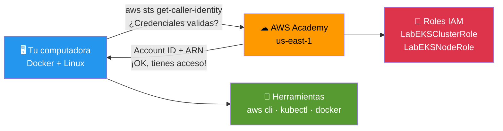

# Etapa 01 — Valida Entorno

## De qué se trata

Antes de construir una casa, revisas que tenes los planos, las herramientas y los permisos. Esta etapa hace exactamente eso pero en AWS: verifica que tu computadora tenga todo lo necesario y que tus credenciales de AWS Academy funcionen.

## Qué hace en detalle

1. Corrige archivos con formato Windows (CRLF → LF) por si acaso
2. Verifica que `aws`, `kubectl` y `docker` esten instalados
3. Valida que las credenciales AWS Academy esten activas (`aws sts get-caller-identity`)
4. Confirma que tienes permisos IAM y acceso a EKS
5. Busca los roles `LabEksClusterRole` y `LabEksNodeRole` que AWS Academy crea automaticamente

## Diagrama

