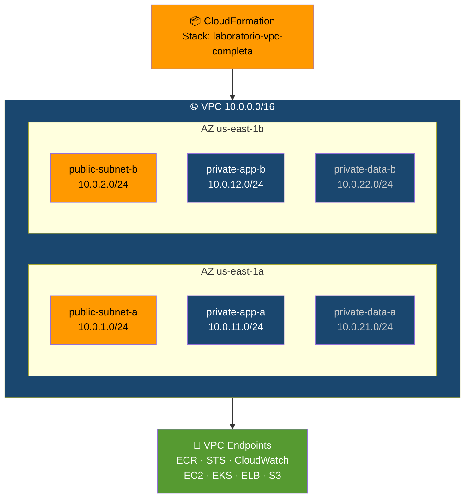

# Etapa 02 — Crea VPC

## De qué se trata

Imagina que necesitas un terreno privado con calles, portones y servicios basicos antes de construir. Esta etapa crea ese "terreno" en AWS: una VPC (red privada virtual) con subnets publicas y privadas en dos zonas de disponibilidad, mas todos los "portones" (VPC Endpoints) para que los servicios AWS se comuniquen sin salir a internet.

## Qué hace en detalle

1. Toma el template CloudFormation `vpc.yaml` (del Bloque 1)
2. Lo despliega como stack `laboratorio-vpc-completa`
3. Espera a que todos los recursos esten creados
4. Muestra la VPC, las 6 subnets y los 8 VPC Endpoints creados

**Recursos creados:** VPC 10.0.0.0/16 · Internet Gateway · 2 subnets publicas · 2 subnets privadas app · 2 subnets privadas data · 8 VPC Endpoints (S3, ECR, STS, CloudWatch, EC2, EKS, ELB)

## Diagrama

