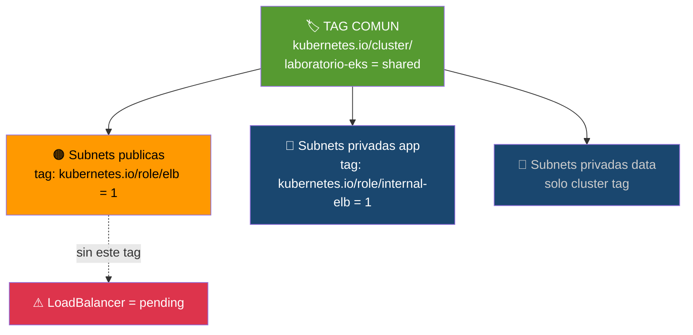

# Etapa 03 — Valida Subnets EKS

## De qué se trata

Kubernetes necesita saber cuales calles son publicas y cuales privadas para crear LoadBalancers automaticamente. Esta etapa revisa que las subnets tengan las "etiquetas" (tags) correctas. Si faltan, los Services tipo LoadBalancer se quedan en estado `<pending>` para siempre.

## Qué hace en detalle

1. Obtiene el ID de la VPC `laboratorio-vpc`
2. Lista todas las subnets con sus tags
3. Verifica que cada subnet tenga los tags EKS requeridos:
   - `kubernetes.io/cluster/laboratorio-eks = shared` (todas)
   - `kubernetes.io/role/elb = 1` (publicas)
   - `kubernetes.io/role/internal-elb = 1` (privadas app)
4. Muestra el estado de los VPC Endpoints

## Diagrama

