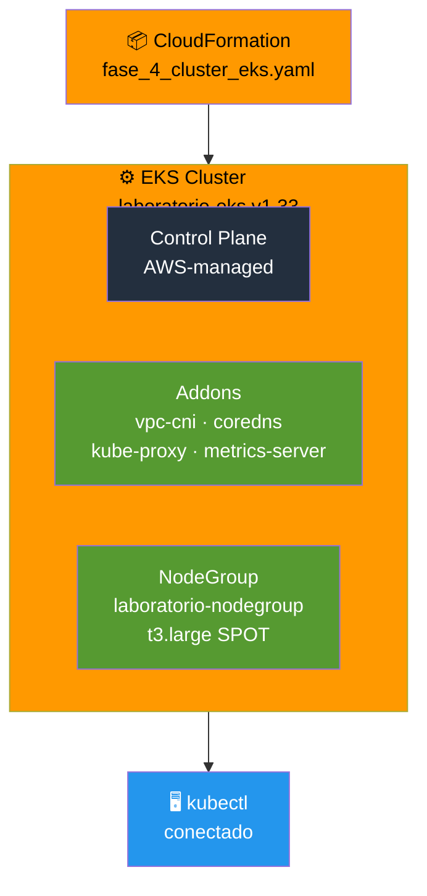

# Etapa 04 — Crea Cluster EKS

## De qué se trata

Este es el corazon del laboratorio. Creas el cluster de Kubernetes administrado por AWS. Es como alquilar el "cerebro" que va a manejar todos tus contenedores. AWS se encarga del API Server, el Scheduler, etcd y todo el plano de control. Tu solo le dices cuantas maquinas quieres y en que red.

## Qué hace en detalle

1. Obtiene los IDs de la VPC y subnets desde CloudFormation
2. Obtiene los ARN de los roles IAM
3. Despliega el template `fase_4_cluster_eks.yaml` que crea:
   - Cluster EKS `laboratorio-eks` (v1.33)
   - Addons: vpc-cni, coredns, kube-proxy, metrics-server
   - Security Group del cluster
   - NodeGroup SPOT (t3.large, 1-3 nodos)
   - Logging a CloudWatch
4. Configura kubectl para conectarse al cluster
5. Valida que el cluster responda

**Tiempo estimado: ~15 minutos** (es lo que tarda AWS en provisionar todo)

## Diagrama

