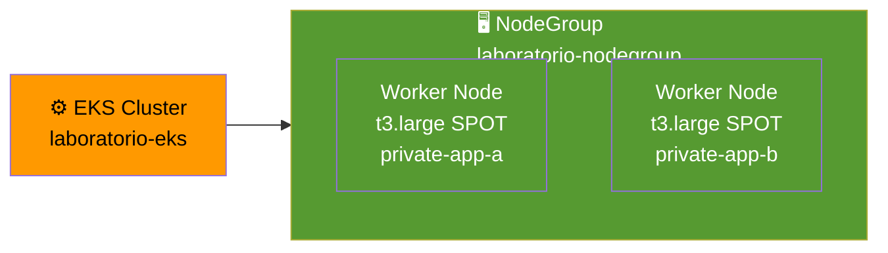

# Etapa 05 — Crea NodeGroup

## De qué se trata

El cluster ya tiene "cerebro" (Control Plane) pero aun no tiene "musculo" (maquinas donde ejecutar los Pods). Esta etapa se asegura de que los worker nodes esten listos. Si el NodeGroup ya fue creado por CloudFormation en la etapa04, simplemente espera a que termine de iniciar.

## Qué hace en detalle

1. Verifica si el NodeGroup `laboratorio-nodegroup` ya existe (CloudFormation lo crea)
2. Si ya existe: espera a que este `ACTIVE`
3. Si no existe: lo crea desde cero con:
   - Tipo de instancia: t3.large SPOT
   - Subnets: private-app-a, private-app-b
   - Escalado: min 1, max 3, desired 1
   - Disco: 20 GB
4. Configura kubectl y valida que los nodos aparezcan `Ready`

**Tiempo estimado: ~10 minutos** si se crea desde cero, ~1 minuto si ya existe

## Diagrama

