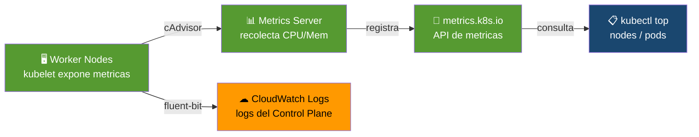

# Etapa 06 — Valida Observabilidad

## De qué se trata

Un cluster sin monitoreo es como volar de noche sin instrumentos. Esta etapa verifica que puedas "ver" lo que pasa en tu cluster: cuanto CPU y memoria usan los nodos y Pods, y que los logs del plano de control se esten enviando a CloudWatch.

## Qué hace en detalle

**Metrics Server:**
1. Verifica que el pod de metrics-server este corriendo en kube-system
2. Confirma que la API `metrics.k8s.io` este registrada
3. Ejecuta `kubectl top nodes` y `kubectl top pods` — estos comandos fallan si metrics-server no funciona
4. Esto es CRITICO para el HPA (etapa08): sin metrics, el autoscaler no puede decidir si escalar

**CloudWatch:**
5. Verifica que el VPC Endpoint de CloudWatch Logs este `available`
6. Revisa que el logging del cluster este habilitado (api, audit, authenticator, etc.)
7. Lista los log groups y log streams

## Diagrama

