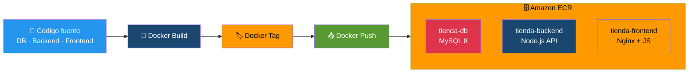

# Etapa 07 — Publica en ECR

## De qué se trata

Necesitas empaquetar tu aplicacion en contenedores y subirlos a un registro privado en AWS. Es como preparar tres cajas (MySQL, Backend, Frontend), sellarlas y dejarlas en una bodega de Amazon (ECR) para que Kubernetes las recoja cuando las necesite. **Esta etapa NO depende del cluster EKS**, por eso se puede ejecutar en paralelo con la etapa04.

## Qué hace en detalle

1. Crea 3 repositorios en Amazon ECR: `tienda-db`, `tienda-backend`, `tienda-frontend`
2. Hace login en ECR
3. Para cada aplicacion (db, backend, frontend):
   - `docker build`: construye la imagen desde el Dockerfile
   - `docker tag`: le pone la etiqueta `eks-v1` y la URI de ECR
   - `docker push`: la sube al registro
   - Valida que la imagen aparezca en ECR

Al final muestra las 3 URIs que se usaran en los archivos YAML de Kubernetes.

**Tiempo estimado: ~10 minutos**

## Diagrama

