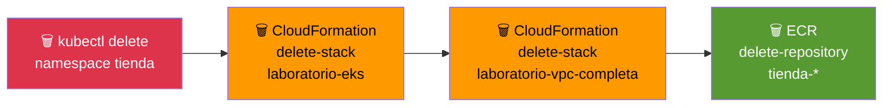

# Etapa 12 — Limpieza Total

## De qué se trata

Borra absolutamente todo lo que se creo en el laboratorio. Es como "desarmar la casa" para dejar el terreno limpio. Util si queres rehacer el laboratorio desde cero o si ya terminaste y no queres dejar recursos cobrando (aunque en AWS Academy se borran solos al cerrar).

## Qué hace en detalle

1. **Borra el namespace tienda** → elimina Pods, Services, Deployments, HPA y el LoadBalancer
2. **Borra el stack CloudFormation `laboratorio-eks`** → elimina cluster EKS, NodeGroup, workers EC2, addons (~10-15 min)
3. **Borra el stack CloudFormation `laboratorio-vpc-completa`** → elimina VPC, subnets, Internet Gateway, VPC Endpoints (~5 min)
4. **Borra los repositorios ECR** → elimina `tienda-db`, `tienda-backend`, `tienda-frontend` con sus imagenes
5. **Limpia el kubeconfig local**

**Tiempo estimado: ~20 minutos**

## Diagrama

