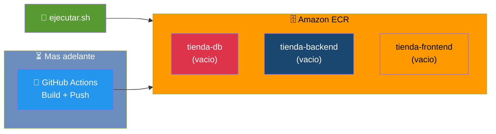

# Etapa 07 — Crea repositorios en ECR

## De que se trata

Necesitas crear los repositorios privados en Amazon ECR donde se almacenaran las imagenes de los contenedores (MySQL, Backend, Frontend). Es como reservar tres bodegas en AWS que luego seran llenadas automaticamente por GitHub Actions al hacer push a main. **Esta etapa NO depende del cluster EKS**, por eso se puede ejecutar en paralelo con la etapa04.

## Que hace en detalle

1. Crea 3 repositorios en Amazon ECR: `tienda-db`, `tienda-backend`, `tienda-frontend`
2. Si alguno ya existe, lo omite sin error
3. Muestra las URIs de los repositorios creados

Las imagenes **no se publican aqui**. Se publican automaticamente mediante GitHub Actions (CI/CD) en cada push a `main` de los repositorios correspondientes.

**Tiempo estimado: ~2 minutos**

## Diagrama

