# Bloque 06 — Diseño de la solución

## Vista general

Este laboratorio despliega una aplicación de alumnos online (frontend + backend + base de datos) en Amazon EKS usando infraestructura como código, CI/CD con GitHub Actions y observabilidad completa.

---

## Desglose paso a paso

### Paso 1 — Validar entorno Docker + AWS

| Aspecto | Detalle |
|---------|---------|
| **¿Qué se hace?** | Verifica que Docker, AWS CLI, kubectl y las credenciales AWS estén configuradas. Busca los roles IAM necesarios para EKS. |
| **¿Qué se logra?** | Entorno validado y listo para crear el clúster EKS. |

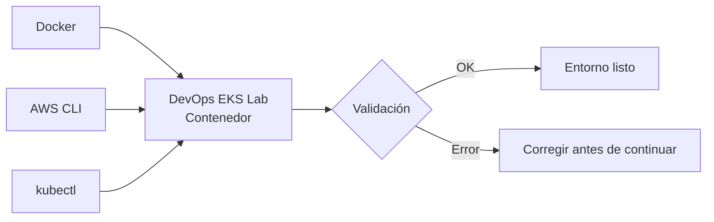

---

### Paso 2 — Crear VPC Multi-AZ con CloudFormation

| Aspecto | Detalle |
|---------|---------|
| **¿Qué se hace?** | Despliega una VPC completa con subnets públicas/privadas, NAT Gateway, VPC Endpoints y路由表 mediante CloudFormation. |
| **¿Qué se logra?** | Una VPC multi-AZ lista como base de red para el clúster EKS. |

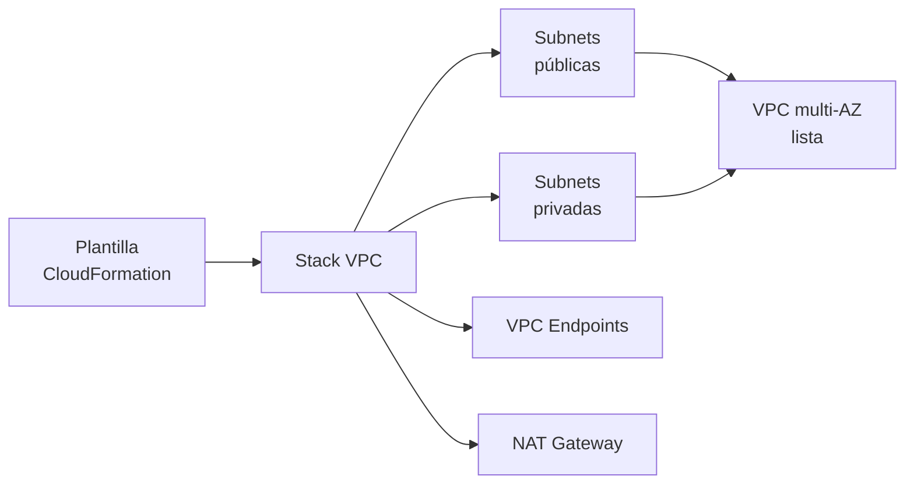

---

### Paso 3 — Validar tags EKS en subnets

| Aspecto | Detalle |
|---------|---------|
| **¿Qué se hace?** | Verifica que las subnets tengan los tags requeridos por EKS: `kubernetes.io/cluster/laboratorio-eks = shared`, `kubernetes.io/role/elb` (públicas) y `kubernetes.io/role/internal-elb` (privadas). Valida los VPC Endpoints. |
| **¿Qué se logra?** | Subnets etiquetadas correctamente para que EKS pueda descubrirlas y los Load Balancers se aprovisionen en las subnets adecuadas. |

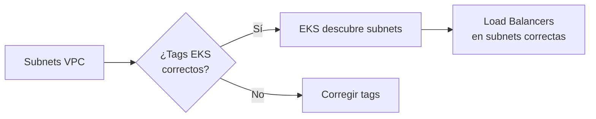

---

### Paso 4 — Crear Cluster EKS + Conectar kubectl

| Aspecto | Detalle |
|---------|---------|
| **¿Qué se hace?** | Despliega el clúster EKS `laboratorio-eks` con CloudFormation, incluyendo addons (vpc-cni, coredns, kube-proxy, metrics-server) y un NodeGroup SPOT. Configura kubectl y valida que el plano de control responda. |
| **¿Qué se logra?** | Clúster EKS completamente operativo con NodeGroup, kubectl conectado. Tiempo estimado: ~15 min. |

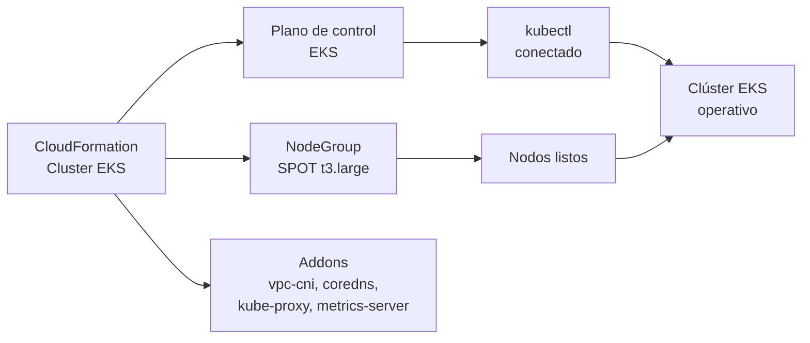

---

### Paso 5 — Validar / Crear NodeGroup SPOT

| Aspecto | Detalle |
|---------|---------|
| **¿Qué se hace?** | Verifica que el NodeGroup `laboratorio-nodegroup` esté activo. Si ya fue creado en el paso anterior, espera a que termine de iniciar. Si no existe, lo crea con instancias t3.large SPOT en subnets privadas. |
| **¿Qué se logra?** | Workers nodes Ready en el cluster, NodeGroup en estado ACTIVE y pods de sistema (`kube-system`) corriendo sobre los nodos. |

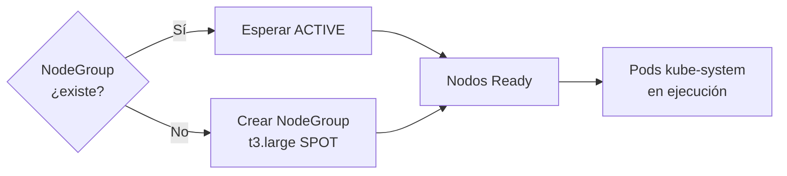

---

### Paso 6 — Validar Metrics Server + CloudWatch

| Aspecto | Detalle |
|---------|---------|
| **¿Qué se hace?** | Verifica que metrics-server exponga CPU/Mem de nodos y pods (`kubectl top`), y que los logs del plano de control se envíen a CloudWatch mediante el VPC Endpoint. |
| **¿Qué se logra?** | Observabilidad completa: `kubectl top` funcionando (crítico para HPA en paso 8) y CloudWatch recibiendo logs del plano de control. |

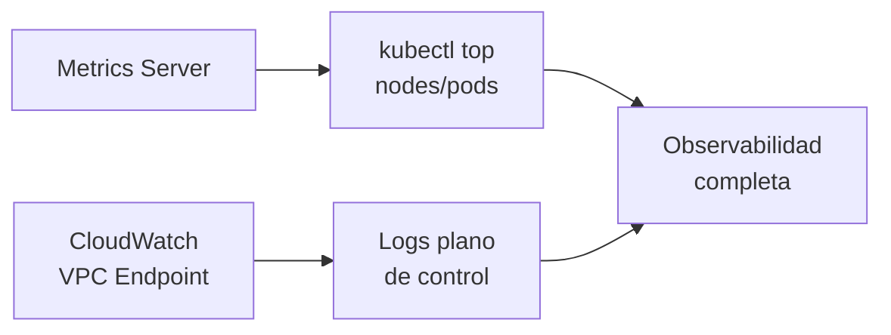

---

### Paso 7 — Crear repositorios en Amazon ECR

| Aspecto | Detalle |
|---------|---------|
| **¿Qué se hace?** | Crear tres repositorios privados en Amazon ECR: `alumnos-db`, `alumnos-backend`, `alumnos-frontend` para almacenar las imágenes Docker. |
| **¿Qué se logra?** | Repositorios ECR listos para recibir imágenes. Tiempo estimado: ~2 min. |

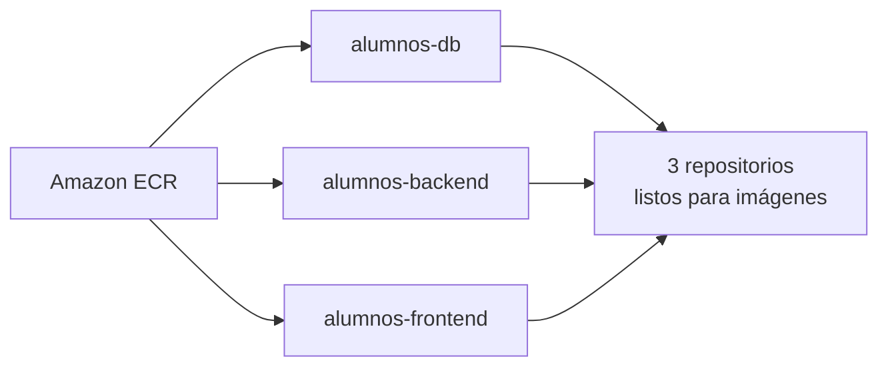

---

### Paso 8 — Publicar en GitHub + Desplegar en Kubernetes

| Aspecto | Detalle |
|---------|---------|
| **¿Qué se hace?** | Crea repositorios en GitHub, configura secrets (credenciales AWS), hace push del código fuente para que GitHub Actions construya y publique imágenes en ECR, y despliega los manifiestos Kubernetes en orden: PostgreSQL → Backend API → Frontend Web con LoadBalancer. |
| **¿Qué se logra?** | Los 3 componentes (DB, Backend, Frontend) corriendo como Pods en el namespace `alumnos`, con Services, HPA y Frontend expuesto mediante LoadBalancer. Tiempo estimado: ~15-20 min. |

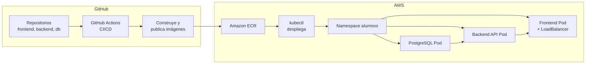

---

### Paso 9 — Validación final + Operación Avanzada

| Aspecto | Detalle |
|---------|---------|
| **¿Qué se hace?** | Verifica estado del clúster (nodos, pods, services, HPA, métricas), obtiene URL del LoadBalancer, y ejecuta operaciones avanzadas: Auto-Healing (matar un pod y verificar recuperación), HPA (stress test), métricas de observabilidad y stress test externo. |
| **¿Qué se logra?** | Validación completa de la aplicación funcionando + auto-healing, HPA responde a carga, métricas visibles. Tiempo estimado: ~5-10 min. |

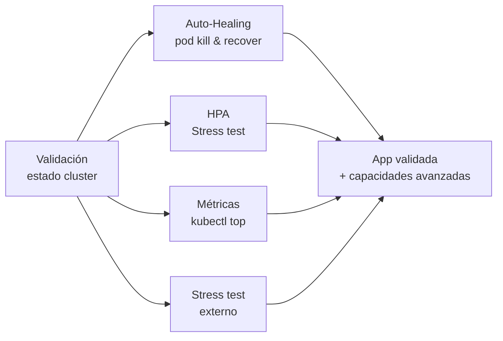

---

### Paso 10 — Conectividad + URL de la aplicación

| Aspecto | Detalle |
|---------|---------|
| **¿Qué se hace?** | Renueva kubeconfig si expiró, verifica conectividad con el clúster y obtiene la URL pública del LoadBalancer del frontend. |
| **¿Qué se logra?** | URL pública de la aplicación lista para abrir en el navegador. |

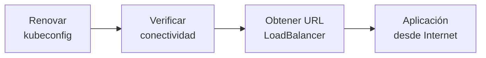

---

### Paso 11 — Auditoría / Reporte completo

| Aspecto | Detalle |
|---------|---------|
| **¿Qué se hace?** | Genera un reporte completo: identidad AWS, VPC, subnets, VPC Endpoints, cluster EKS, NodeGroup, nodos, ECR con imágenes, deployments, services, pods, HPA, eventos de escalamiento y URL de la aplicación. Incluye checklist de evaluación. |
| **¿Qué se logra?** | Archivo `reporte.txt` con toda la evidencia del laboratorio funcionando, listo para entregar. |

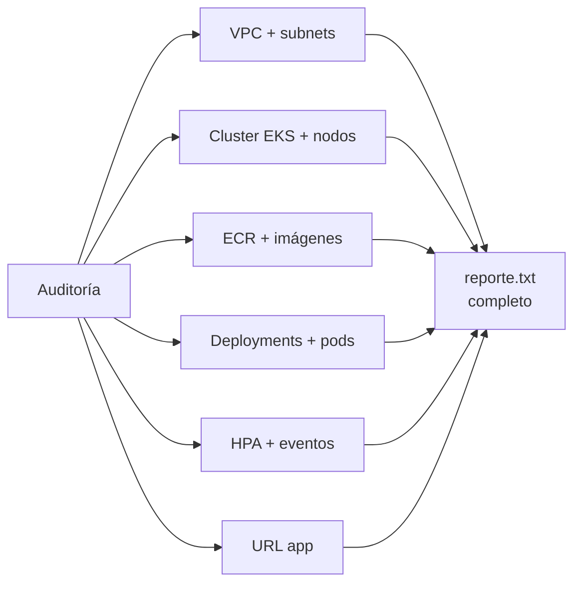

---

### Paso 12 — Limpieza total

| Aspecto | Detalle |
|---------|---------|
| **¿Qué se hace?** | Elimina todos los recursos en orden inverso: namespace `alumnos`, stack CloudFormation del cluster EKS, stack CloudFormation de la VPC, repositorios ECR, repositorios GitHub, directorios locales clonados, entradas kubeconfig y known_hosts. |
| **¿Qué se logra?** | Laboratorio completamente limpio, listo para empezar desde cero. |

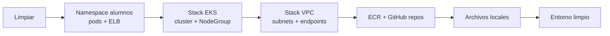

---

## Diagrama acumulativo de toda la solución

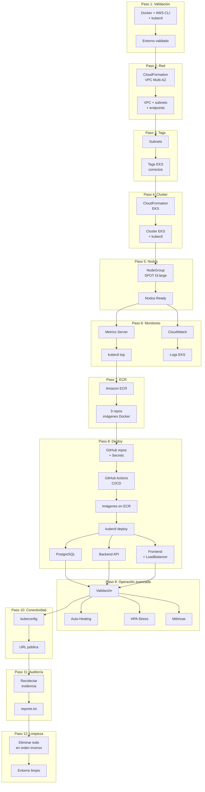
