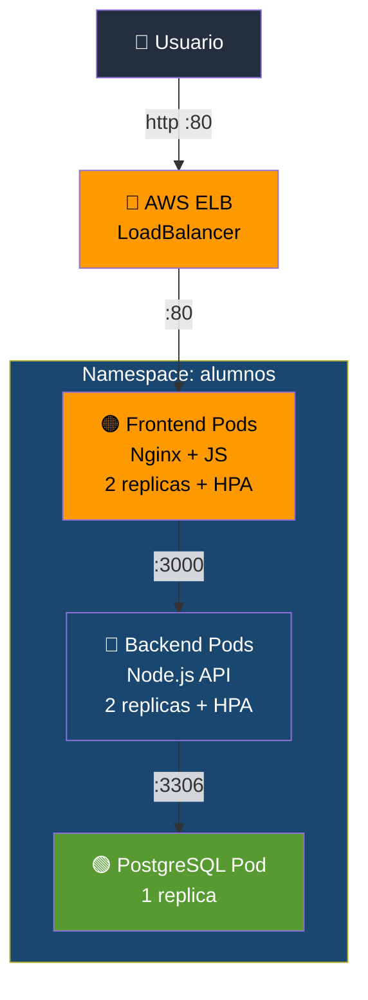

# Etapa 08 — Despliega en Kubernetes

## De qué se trata

Las imagenes ya estan en ECR. Ahora Kubernetes las "desempaqueta" y las pone a correr como Pods. Es como darle la orden al cluster: "ejecuta 1 PostgreSQL, 2 Backends, 2 Frontends, conectalos entre si y expon el Frontend a internet". Todo esto se hace con archivos YAML que describen el estado deseado.

## Qué hace en detalle

**Orden de despliegue (importante respetarlo):**

1. **PostgreSQL** — Sin base de datos, el backend no puede conectarse
   - Crea namespace `alumnos`
   - Aplica Secret (contraseña), Service (ClusterIP), Deployment (1 replica)
   - Espera a que el Pod este `Running`

2. **Backend** — Sin API, el frontend no tiene a quien llamar
   - Reemplaza la URI de la imagen ECR en el YAML
   - Aplica Service (ClusterIP), Deployment (2+ replicas), HPA
   - Espera a que los Pods esten `Running`

3. **Frontend** — Es la cara visible de la aplicacion
   - Reemplaza la URI de la imagen ECR en el YAML
   - Aplica Service (LoadBalancer → crea un AWS ELB), Deployment (2+ replicas), HPA

Al final muestra todos los Pods, Services y HPAs corriendo.

**Tiempo estimado: ~5 minutos** (+ 2-3 min para que el LoadBalancer este listo)

## Diagrama

