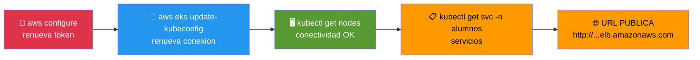

# Etapa 10 — Conectividad y URL

## De qué se trata

Si paso tiempo desde que empezaste, el token de AWS Academy probablemente expiro. Esta etapa renueva la conexion, verifica que todo siga funcionando y te muestra la URL de la aplicacion lista para copiar y pegar en el navegador. Es la etapa que ejecutas cada vez que vuelves al laboratorio.

## Qué hace en detalle

1. Te recuerda renovar `aws configure` si el token expiro
2. Refresca el kubeconfig (`aws eks update-kubeconfig`)
3. Verifica conectividad con el cluster (`kubectl get nodes`)
4. Muestra los servicios en el namespace alumnos
5. **Extrae y muestra la URL publica** en formato `http://...`

## Diagrama

