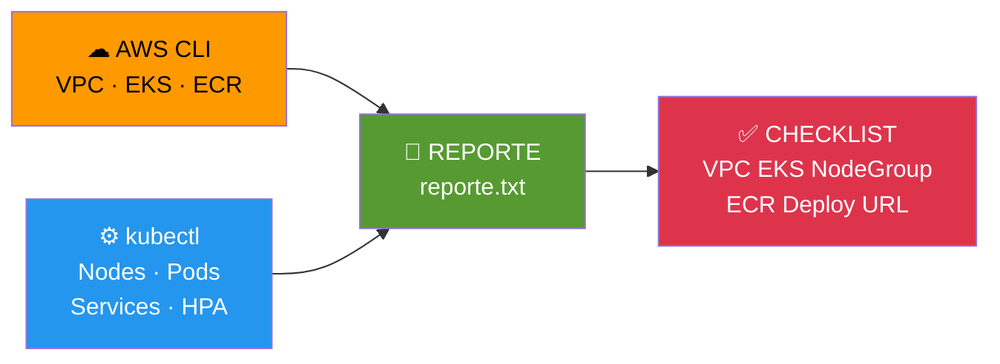

# Etapa 11 — Auditoria

## De qué se trata

Genera un reporte completo de todo lo que construiste en el laboratorio. Sirve para que el profesor evalue tu trabajo o para que tu mismo verifiques que no falto nada. Al final imprime un checklist con [X] o [ ] para cada componente.

## Qué hace en detalle

1. Identidad AWS (Account ID)
2. Estado de la VPC (CloudFormation stack)
3. Subnets creadas
4. VPC Endpoints
5. Estado del cluster EKS
6. Estado del NodeGroup
7. Nodos Kubernetes
8. Repositorios ECR (con imagenes)
9. Namespace alumnos
10. Deployments, Services, Pods, HPA
11. URL publica de la aplicacion
12. **Checklist final de 6 items**

El reporte se guarda en `etapa11-Auditoria/reporte.txt`.

## Diagrama

