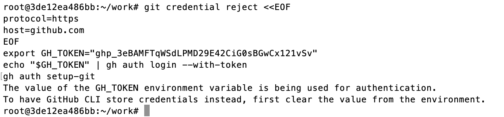

# Ejecución Local - Gestor de Alumnos

## Requisitos Previos

1. **Docker Desktop** debe estar instalado y ejecutándose
2. Verificar que Docker esté corriendo (ícono verde en la barra de tareas)

## Estructura del Proyecto

```
bloque00-aplicacion/
├── database/     # PostgreSQL 16
├── backend/      # Spring Boot + JDK 21
└── frontend/     # Nginx + SPA (HTML/JS)
```

## Inicializar los Servicios

**IMPORTANTE:** En una terminal nueva de windows (no linux) se debe ejecuar en este orden específico:

### Paso 1: Base de Datos

```bash
cd database
docker compose up -d
```

Esperar hasta que el contenedor esté verde en Docker Desktop.

### Paso 2: Backend

```bash
cd ../backend
docker compose up -d
```

Esperar hasta que el contenedor esté verde en Docker Desktop.

### Paso 3: Frontend

```bash
cd ../frontend
docker compose up -d
```

Esperar hasta que el contenedor esté verde en Docker Desktop.

## Verificar en Docker Desktop

Abrir Docker Desktop y verificar que los 3 contenedores estén en estado **Running** (verde):

| Contenedor    | Puerto | Estado esperado |
| ------------- | ------ | --------------- |
| ep03-db       | 5432   | Running (verde) |
| ep03-backend  | 8080   | Running (verde) |
| ep03-frontend | 80     | Running (verde) |

## Probar la Aplicación

Abrir el navegador y ejecutar:

**http://localhost**

Verás la interfaz del Gestor de Alumnos con la lista de productos.

## Endpoints Disponibles

| Servicio | URL                        | Descripción          |
| -------- | -------------------------- | --------------------- |
| Frontend | http://localhost           | Interfaz web          |
| Backend  | http://localhost:8080/ep03 | API REST              |
| Database | localhost:5432             | PostgreSQL (solo red) |

## Comandos Útiles

```bash
# Ver logs de un servicio
docker compose logs -f ep03-db
docker compose logs -f ep03-backend
docker compose logs -f ep03-frontend

# Ver todos los contenedores corriendo
docker ps

# Detener un servicio
docker compose down

# Detener y eliminar volúmenes
docker compose down -v

# Reconstruir un servicio
docker compose up -d --build
```

## Solución de Problemas

### Backend no conecta a la DB

- Verificar que `ep03-db` esté corriendo y verde
- Verificar logs: `docker compose logs ep03-db`

### Frontend no muestra datos

- Verificar que `ep03-backend` esté corriendo
- Verificar logs: `docker compose logs ep03-backend`
- Abrir consola del navegador (F12) para ver errores

### Puerto 80 ocupado

- Cambiar el puerto en `frontend/docker-compose.yml`:
  ```yaml
  ports:
    - "8080:80"  # Acceder en http://localhost:8080
  ```

### Puerto 5432 ocupado

- Cambiar el puerto en `database/docker-compose.yml`:
  ```yaml
  ports:
    - "5433:5432"  # Conectar en localhost:5433
  ```

## Diagrama de Arquitectura

```
┌─────────────────────────────────────────────────────────────┐
│                    Docker Desktop                            │
├─────────────────────────────────────────────────────────────┤
│                                                              │
│  ┌──────────────┐    ┌──────────────┐    ┌──────────────┐   │
│  │  Frontend    │    │   Backend    │    │   Database   │   │
│  │  (Nginx)     │───▶│ (Spring Boot│───▶│ (PostgreSQL) │   │
│  │  :80         │    │  :8080)      │    │  :5432       │   │
│  └──────────────┘    └──────────────┘    └──────────────┘   │
│         │                   │                   │            │
│         └───────────────────┴───────────────────┘            │
│                     ep03-network                          │
└─────────────────────────────────────────────────────────────┘
                          │
                          ▼
                    http://localhost
```

## Crear Repositorios en GitHub

Antes de crear los repositorios en github se debe hacer este paso:

```
git credential reject <<EOF
protocol=https
host=github.com
EOF
export GH_TOKEN="ghp_xxxxxxxxxxxxxxxxx"
echo "$GH_TOKEN" | gh auth login --with-token
gh auth setup-git


```

**Primero se debe copiar este contenido en un notepad y se debe reeemplazar el dato ghp_xxxxxxxxxxxxxxxxx por el token de github, y luego se debe ejecutar en el linux.**



Para cada directorio (database, backend, frontend), crear un repositorio en GitHub:

### Database

**Se debe copiar el siguiente script en un notepad y reemplazar NOMBREPERSONALIZADOREPO_DATABASE por el nombre que se quiera crear en github  (debe ser uno qu eno exista en github):**

```bash
cd bloque00-aplicacion/database
git init
git add .
git commit -m "Initial commit: database"

gh repo create NOMBREPERSONALIZADOREPO_DATABASE \
  --public \
  --source=. \
  --remote=origin \
  --push
```

### Backend

Se debe cambiar **NOMBREPERSONALIZADOREPO_DATABASE** por el nombre del repositorio que quieran crear

```bash
cd ../backend
git init
git add .
git commit -m "Initial commit: backend"

gh repo create  NOMBREPERSONALIZADOREPO_BACKEND \
  --public \
  --source=. \
  --remote=origin \
  --push
```

### Frontend

Se debe cambiar **NOMBREPERSONALIZADOREPO_FRONTEND** por el nombre del repositorio que quieran crear

```bash
cd ../frontend
git init
git add .
git commit -m "Initial commit: frontend"

gh repo create NOMBREPERSONALIZADOREPO_FRONTEND \
  --public \
  --source=. \
  --remote=origin \
  --push
```

## Secrets

Ahora, los tres repositorios se deben agregar al final del archivo secrets.txt

GITHUB_DATABASE=https://github.com/USUARIO/NOMBREPERSONALIZADOREPO_DATABASE.git
GITHUB_BACKEND=https://github.com/USUARIO/NOMBREPERSONALIZADOREPO_BACKEND.git
GITHUB_FRONTEND=https://github.com/USUARIO/NOMBREPERSONALIZADOREPO_FRONTEND.git

```bash

```

## Notas Importantes

- Los datos de la DB se guardan en el volumen `pgdata`
- Para resetear la DB: `docker compose down -v` en database/
- El backend reintenta conexión a la DB automáticamente
- El frontend usa proxy inverso para comunicarse con el backend
