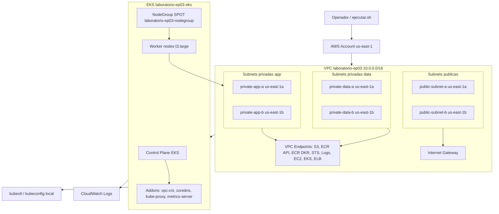

# Bloque 01 - Infraestructura K8s

Este bloque consolida la preparacion de infraestructura de `guia-03` bloques 1, 2 y 3 para llegar rapidamente a un entorno Kubernetes listo en AWS.

El script principal es:

```bash
bash ejecutar.sh
```

El script es idempotente: si la VPC, el cluster EKS, el NodeGroup o los addons ya existen, valida su estado y continua. Si faltan, los crea usando los templates locales incluidos en `templates/`.

## Que prepara

- VPC Multi-AZ `laboratorio-ep03` con subnets publicas, privadas de aplicacion y privadas de datos.
- VPC Endpoints para servicios requeridos por EKS/ECR/CloudWatch.
- Cluster EKS `laboratorio-ep03-eks`.
- Addons EKS: `vpc-cni`, `coredns`, `kube-proxy` y `metrics-server`.
- NodeGroup SPOT `laboratorio-ep03-nodegroup` en subnets privadas de aplicacion.
- Kubeconfig local apuntando al cluster.
- Validacion de nodos, pods de sistema, Metrics Server y CloudWatch logs.
- Reporte Markdown en `reports/` con resumen y comandos de evidencia.

## Diagrama



## Variables utiles

Puedes sobreescribir valores por variable de entorno:

```bash
REGION=us-east-1 \
VPC_STACK=laboratorio-ep03-vpc \
EKS_STACK=laboratorio-ep03-eks \
CLUSTER_NAME=laboratorio-ep03-eks \
NODEGROUP_NAME=laboratorio-ep03-nodegroup \
bash ejecutar.sh
```

## Archivos locales usados

- `templates/vpc.yaml`: template CloudFormation de VPC copiado desde guia-03.
- `templates/cluster_eks.yaml`: template CloudFormation de EKS copiado desde guia-03.
- `../secrets.txt`: credenciales/variables de laboratorio ubicadas en la raiz de `guia-04`, si existe.

## Salida esperada

Al finalizar deberias ver:

- Stack VPC en estado `CREATE_COMPLETE` o `UPDATE_COMPLETE`.
- Stack EKS en estado `CREATE_COMPLETE` o `UPDATE_COMPLETE`.
- Cluster EKS `ACTIVE`.
- NodeGroup `ACTIVE`.
- Nodos Kubernetes en estado `Ready`.
- Pods de `kube-system` visibles.
- Reporte generado en `reports/infra-k8s-YYYYMMDD-HHMMSS.md`.

## Comandos de verificacion

```bash
aws eks describe-cluster --region us-east-1 --name laboratorio-ep03-eks --query 'cluster.{name:name,status:status,version:version}' --output table
aws eks describe-nodegroup --region us-east-1 --cluster-name laboratorio-ep03-eks --nodegroup-name laboratorio-ep03-nodegroup --query 'nodegroup.{name:nodegroupName,status:status,capacity:capacityType}' --output table
kubectl get nodes -o wide
kubectl get pods -n kube-system -o wide
kubectl top nodes
```
