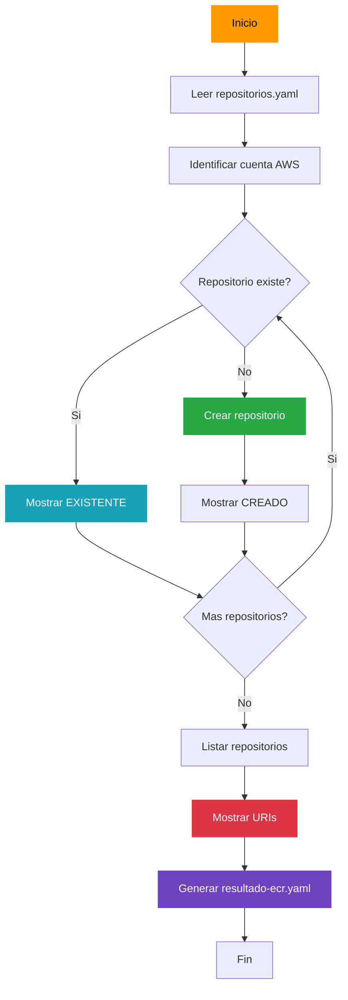
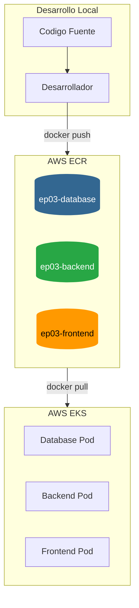
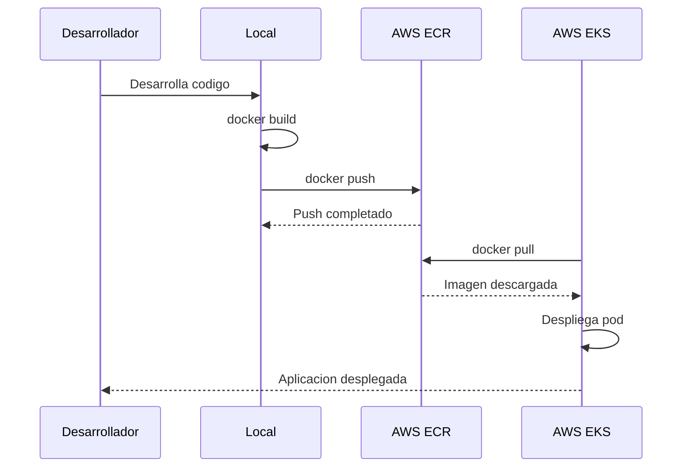

# Guía ECR - Repositorios de Contenedores Docker

## Estructura del Proyecto

```
bloque02-ecr/
├── repositorios.yaml    # Configuración de repositorios
├── ejecutar-ecr.sh      # Script de gestión ECR
├── resultado-ecr.yaml   # Resultado generado (gitignore)
├── .gitignore           # Excluye archivos generados
└── README.md            # Esta documentación
```

## Configuración

Edita `repositorios.yaml` para agregar o modificar repositorios:

```yaml
REPOSITORIES:
  - Name: ep03-database
    Description: Repositorio para imagen de base de datos
    ImageTagMutability: MUTABLE
    ScanOnPush: false

  - Name: ep03-backend
    Description: Repositorio para imagen de backend Spring Boot
    ImageTagMutability: MUTABLE
    ScanOnPush: false

  - Name: ep03-frontend
    Description: Repositorio para imagen de frontend Nginx
    ImageTagMutability: MUTABLE
    ScanOnPush: false
```

## Uso

### Ejecutar script completo
```bash
./ejecutar-ecr.sh
```

El script realizará:
1. Identificar la cuenta AWS actual
2. Leer repositorios desde `repositorios.yaml`
3. Crear repositorios ECR (si no existen)
4. Listar todos los repositorios con sus URIs
5. Generar archivo `resultado-ecr.yaml` con los valores

## Proceso que realiza el script

### Paso 1: Identificación de cuenta AWS
```bash
aws sts get-caller-identity
```
Obtiene:
- Account ID (número de cuenta)
- ARN (identificador del usuario/rol)
- Región configurada

### Paso 2: Lectura de repositorios
Lee el archivo `repositorios.yaml` y extrae los nombres de los repositorios a crear.

### Paso 3: Creación de repositorios
```bash
aws ecr create-repository --repository-name <nombre>
```
Para cada repositorio:
- Verifica si ya existe
- Si no existe, lo crea con las configuraciones especificadas
- Si ya existe, muestra [EXISTENTE]

### Paso 4: Listado de repositorios
```bash
aws ecr describe-repositories
```
Muestra:
- Nombre del repositorio
- URI completa (para docker push)
- Fecha de creación

### Paso 5: Generación de archivo resultado
Genera `resultado-ecr.yaml` con:
- Información de la cuenta AWS
- URIs de cada repositorio
- Comandos para push de imágenes

## Diagrama de Flujo



## Diagrama de Arquitectura



## Comandos Útiles de AWS ECR

```bash
# Listar repositorios
aws ecr describe-repositories --query 'repositories[*].repositoryName' --output table

# Obtener URI de un repositorio
aws ecr describe-repositories --repository-names ep03-backend --query 'repositories[0].repositoryUri' --output text

# Login a ECR
aws ecr get-login-password --region us-east-1 | docker login --username AWS --password-stdin <account-id>.dkr.ecr.us-east-1.amazonaws.com

# Listar imagenes en un repositorio
aws ecr list-images --repository-name ep03-backend

# Eliminar repositorio
aws ecr delete-repository --repository-name ep03-backend --force
```

## Flujo de Trabajo Completo



## Ejemplo de resultado-ecr.yaml

```yaml
# resultado-ecr.yaml - Resultado de creacion de repositorios ECR

aws_account:
  account_id: "123456789012"
  account_alias: "mi-cuenta"
  region: "us-east-1"
  arn: "arn:aws:iam::123456789012:root"
  login_command: "aws ecr get-login-password --region us-east-1 | docker login --username AWS --password-stdin 123456789012.dkr.ecr.us-east-1.amazonaws.com"

repositories:
  - name: "ep03-database"
    uri: "123456789012.dkr.ecr.us-east-1.amazonaws.com/ep03-database"
    created_at: "2025-01-15T10:30:00Z"
    push_command: "docker tag ep03-database:latest 123456789012.dkr.ecr.us-east-1.amazonaws.com/ep03-database:latest && docker push 123456789012.dkr.ecr.us-east-1.amazonaws.com/ep03-database:latest"
  - name: "ep03-backend"
    uri: "123456789012.dkr.ecr.us-east-1.amazonaws.com/ep03-backend"
    created_at: "2025-01-15T10:30:05Z"
    push_command: "docker tag ep03-backend:latest 123456789012.dkr.ecr.us-east-1.amazonaws.com/ep03-backend:latest && docker push 123456789012.dkr.ecr.us-east-1.amazonaws.com/ep03-backend:latest"
  - name: "ep03-frontend"
    uri: "123456789012.dkr.ecr.us-east-1.amazonaws.com/ep03-frontend"
    created_at: "2025-01-15T10:30:10Z"
    push_command: "docker tag ep03-frontend:latest 123456789012.dkr.ecr.us-east-1.amazonaws.com/ep03-frontend:latest && docker push 123456789012.dkr.ecr.us-east-1.amazonaws.com/ep03-frontend:latest"
```

## Notas Importantes

- Los repositorios se crean en la región configurada en AWS CLI
- `ImageTagMutability: MUTABLE` permite sobreescribir tags como `latest`
- `ScanOnPush: false` desactiva el escaneo automático (reduce costos)
- Los repositorios vacíos no generan costos
- El script es idempotente: puede ejecutarse múltiples veces sin problemas
- El archivo `resultado-ecr.yaml` está en `.gitignore` (contiene datos sensibles)