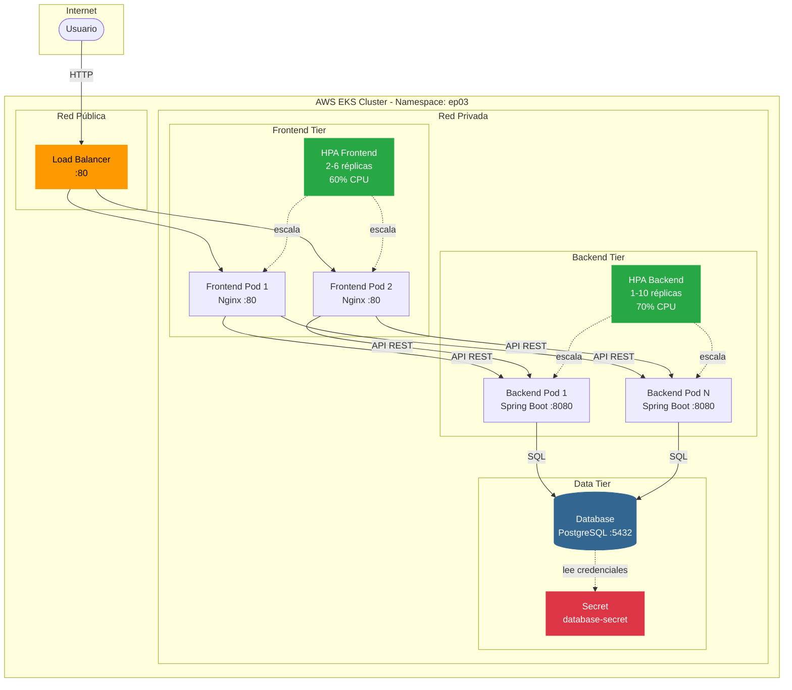
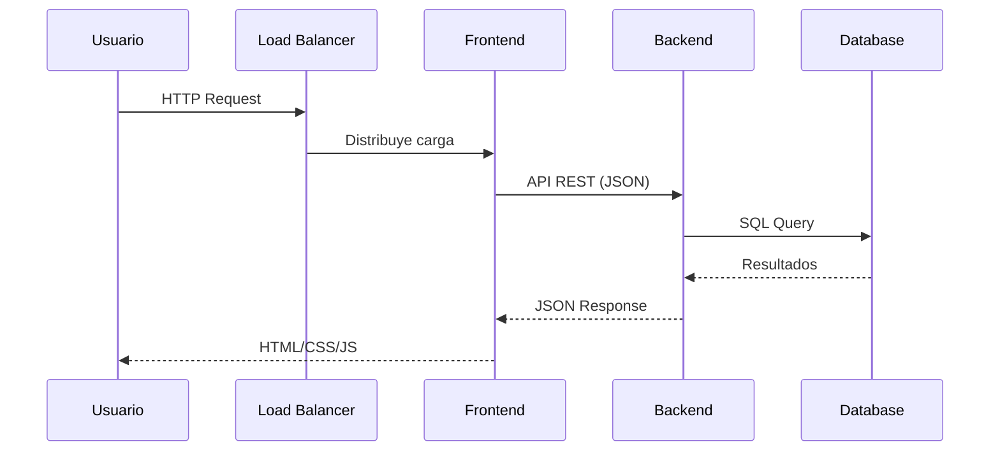
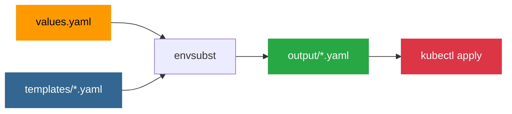

# Guía Kubernetes - Arquitectura de Microservicios

## Estructura del Proyecto

```
bloque02-k8s/
├── values.yaml              # Configuración centralizada
├── templates/               # Plantillas YAML con variables
│   ├── namespace.yaml
│   ├── database-secret.yaml
│   ├── database-deployment.yaml
│   ├── database-service.yaml
│   ├── backend-deployment.yaml
│   ├── backend-service.yaml
│   ├── frontend-deployment.yaml
│   ├── frontend-service.yaml
│   ├── backend-hpa.yaml
│   └── frontend-hpa.yaml
├── output/                  # YAMLs generados (gitignore)
├── apply-all.sh             # Genera y aplica
├── generate.sh              # Solo genera YAMLs
└── preview.sh               # Preview sin aplicar
```

## Configuración Centralizada

Edita `values.yaml` para cambiar cualquier parámetro:

```bash
# Namespace
NAMESPACE=ep03

# Imágenes
DATABASE_IMAGE=461663648686.dkr.ecr.us-east-1.amazonaws.com/ep03-db:latest
BACKEND_IMAGE=461663648686.dkr.ecr.us-east-1.amazonaws.com/ep03-backend:latest
FRONTEND_IMAGE=461663648686.dkr.ecr.us-east-1.amazonaws.com/ep03-frontend:latest

# Base de datos
DATABASE_NAME=ep03
DATABASE_USER=ep03_user
DATABASE_PASSWORD_B64=YWx1bW5vc19wYXNz

# Backend
BACKEND_HPA_MIN=1
BACKEND_HPA_MAX=10
BACKEND_HPA_CPU=70

# Frontend
FRONTEND_HPA_MIN=2
FRONTEND_HPA_MAX=6
FRONTEND_HPA_CPU=60
```

## Scripts Disponibles

### `apply-all.sh` - Generar y aplicar

```bash
bash apply-all.sh
```

1. Lee `values.yaml`
2. Genera YAMLs en `output/`
3. Aplica todos los manifiestos a Kubernetes

### `generate.sh` - Solo generar

```bash
./generate.sh
```

Genera los YAMLs sin aplicarlos (útil para inspeccionar).

### `preview.sh` - Preview

```bash
./preview.sh
```

Genera y muestra los archivos generados.

## Comandos Explicados

### 1. Namespace

Crea el namespace aislado para todos los recursos del proyecto.

### 2. Secret

Almacena credenciales en base64 para la base de datos.

### 3. Base de Datos

- **Deployment**: PostgreSQL con health checks TCP
- **Service**: ClusterIP interno `ep03-db:5432`

### 4. Backend

- **Deployment**: Spring Boot con métricas para HPA
- **Service**: ClusterIP interno `ep03-backend:8080`

### 5. Frontend

- **Deployment**: Nginx con RollingUpdate
- **Service**: Load Balancer público AWS

### 6. HPA

Escalado automático basado en CPU:

- Backend: 1-10 réplicas (70% CPU)
- Frontend: 2-6 réplicas (60% CPU)

## Diagrama de Arquitectura



## Flujo de Datos



## Flujo de Generación



## Comandos Útiles

```bash
# Verificar estado
kubectl get all -n ep03

# Ver pods
kubectl get pods -n ep03 -o wide

# Ver HPA
kubectl get hpa -n ep03

# Logs
kubectl logs -f <pod-name> -n ep03

# Shell en pod
kubectl exec -it <pod-name> -n ep03 -- /bin/bash
```

## Notas Importantes

- Edita `values.yaml` para cambiar configuración
- Los templates usan variables `${VAR}` con envsubst
- El directorio `output/` contiene los YAMLs generados
- Las imágenes están en ECR privado de AWS
- Los HPA requieren Metrics Server
