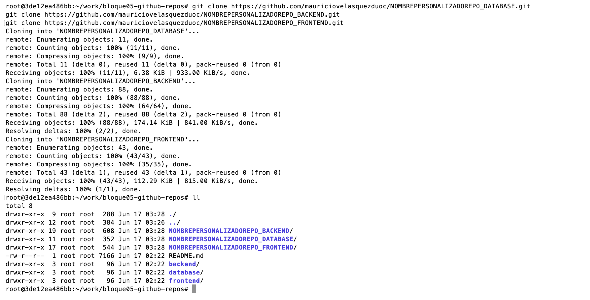

# Guía de Despliegue - GitHub Actions CI/CD

## Estructura

```
bloque05-github-repos/
├── backend/workflows/deploy-backend-eks.yml
├── database/workflows/deploy-database-eks.yml
└── frontend/workflows/deploy-frontend-eks.yml
```

## Orden de Despliegue

**IMPORTANTE:** Desplegar en este orden específico:

1. **database** → Base de datos primero
2. **backend** → API que depende de la BD
3. **frontend** → UI que depende del backend

## Paso 1: Clonar tus repositorios

### Clonar DATABASE

**Se debe cambiar TU_USUARIO por el usuario de github**

```bash

git clone https://github.com/TU_USUARIO/NOMBREPERSONALIZADOREPO_DATABASE.git
```

### Clonar BACKEND

```bash
git clone https://github.com/TU_USUARIO/NOMBREPERSONALIZADOREPO_BACKEND.git

```

### Clonar FRONTEND

```bash
git clone https://github.com/TU_USUARIO/NOMBREPERSONALIZADOREPO_FRONTEND.git

```



## Paso 2: Copiar el workflow

```bash
# Crear directorio de workflows


# Copiar el workflow según tu repositorio:

# PARA DATABASE:
cd NOMBREPERSONALIZADOREPO_DATABASE
mkdir -p .github/workflows
cp ../database/workflows/deploy-database-eks.yml .github/workflows/
git add .
git commit -m "feat: add CI/CD workflow"
git push origin main

# PARA BACKEND:
cd ../NOMBREPERSONALIZADOREPO_BACKEND
mkdir -p .github/workflows
cp ../backend/workflows/deploy-backend-eks.yml .github/workflows/
git add .
git commit -m "feat: add CI/CD workflow"
git push origin main

# PARA FRONTEND:
cd ../NOMBREPERSONALIZADOREPO_FRONTEND
mkdir -p .github/workflows
cp ../frontend/workflows/deploy-frontend-eks.yml .github/workflows/
git add .
git commit -m "feat: add CI/CD workflow"
git push origin main
```

## Paso 3: Verificar en GitHub Actions

1. Ir a tu repositorio en GitHub
2. Hacer clic en la pestaña **"Actions"**
3. Verás el workflow ejecutándose automáticamente
4. Hacer clic en el workflow para ver el progreso de cada paso


## Paso 4: Verificar el despliegue

```bash
# Ver pods ejecutándose
kubectl get pods -n ep03

# Ver servicios
kubectl get svc -n ep03

# Ver deployments
kubectl get deployments -n ep03
```

## Paso 6: Obtener IP pública del Load Balancer

```bash
# Obtener la URL del frontend
kubectl get svc ep03-frontend \
  -n ep03 \
  -o custom-columns=NAME:.metadata.name,TYPE:.spec.type,CLUSTER-IP:.spec.clusterIP,EXTERNAL-HOST:.status.loadBalancer.ingress[0].hostname,PORT:.spec.ports[0].port

# O de forma más completa
kubectl get svc -n ep03

# Copiar el EXTERNAL-IP del frontend y abrir en el navegador:
# http://<EXTERNAL-IP>
```

## Flujo Completo

```
┌─────────────────────────────────────────────────────────────────┐
│                        ORDEN DE DESPLIEGUE                      │
├─────────────────────────────────────────────────────────────────┤
│                                                                 │
│  1. DATABASE (Primero)                                          │
│     ├── Clonar repo database                                    │
│     ├── Copiar deploy-database-eks.yml                          │
│     ├── git push                                                │
│     └── Esperar a que complete ✓                                │
│                          │                                      │
│                          ▼                                      │
│  2. BACKEND (Segundo)                                           │
│     ├── Clonar repo backend                                     │
│     ├── Copiar deploy-backend-eks.yml                           │
│     ├── git push                                                │
│     └── Esperar a que complete ✓                                │
│                          │                                      │
│                          ▼                                      │
│  3. FRONTEND (Tercero)                                          │
│     ├── Clonar repo frontend                                    │
│     ├── Copiar deploy-frontend-eks.yml                          │
│     ├── git push                                                │
│     └── Esperar a que complete ✓                                │
│                          │                                      │
│                          ▼                                      │
│  4. VERIFICAR                                                   │
│     ├── kubectl get svc -n ep03                              │
│     ├── Copiar EXTERNAL-IP                                      │
│     └── Abrir http://<EXTERNAL-IP>                              │
│                                                                 │
└─────────────────────────────────────────────────────────────────┘
```

## Qué hace cada Workflow

### Database

- **Jobs:** Versioning → Build & Push ECR
- **Resultado:** Imagen `ep03-database` en ECR

### Backend

- **Jobs:** Code Quality → Build & Test → Security → Versioning → Build & Push ECR
- **Resultado:** Imagen `ep03-backend` en ECR

### Frontend

- **Jobs:** Test → Quality → Versioning → Build & Push ECR
- **Resultado:** Imagen `ep03-frontend` en ECR

## Comandos Útiles

```bash
# Ver workflows ejecutándose
gh run list --repo TU_USUARIO/TU_REPO

# Ver logs de un workflow
gh run view ID_RUN --repo TU_USUARIO/TU_REPO --log

# Verificar secretos configurados
gh secret list --repo TU_USUARIO/TU_REPO

# Ver pods en tiempo real
kubectl get pods -n ep03 --watch

# Ver logs de un pod
kubectl logs -f POD_NAME -n ep03

# Reiniciar un deployment
kubectl rollout restart deployment/DEPLOYMENT_NAME -n ep03
```

## Solución de Problemas

### Workflow no inicia

- Verificar que el archivo esté en `.github/workflows/`
- Verificar que el nombre del archivo termine en `.yml`
- Verificar que los secrets estén configurados en GitHub

### Pods en estado Error

```bash
# Ver logs del pod con error
kubectl logs POD_NAME -n ep03

# Ver eventos
kubectl get events -n ep03 --sort-by='.lastTimestamp'
```

### No se obtiene IP del Load Balancer

```bash
# Verificar si el servicio tiene EXTERNAL-IP
kubectl get svc ep03-frontend -n ep03

# Si dice "<pending>", esperar 2-3 minutos
# Si persiste, verificar logs del controller
kubectl logs -n kube-system -l app.kubernetes.io/name=aws-load-balancer-controller
```

## Notas Importantes

- Los workflows usan `GITHUB_TOKEN` para autenticación
- Los secretos de AWS deben estar configurados en GitHub Secrets
- El primer despliegue puede tardar 5-10 minutos
- Los cambios en `main` activan automáticamente el workflow
